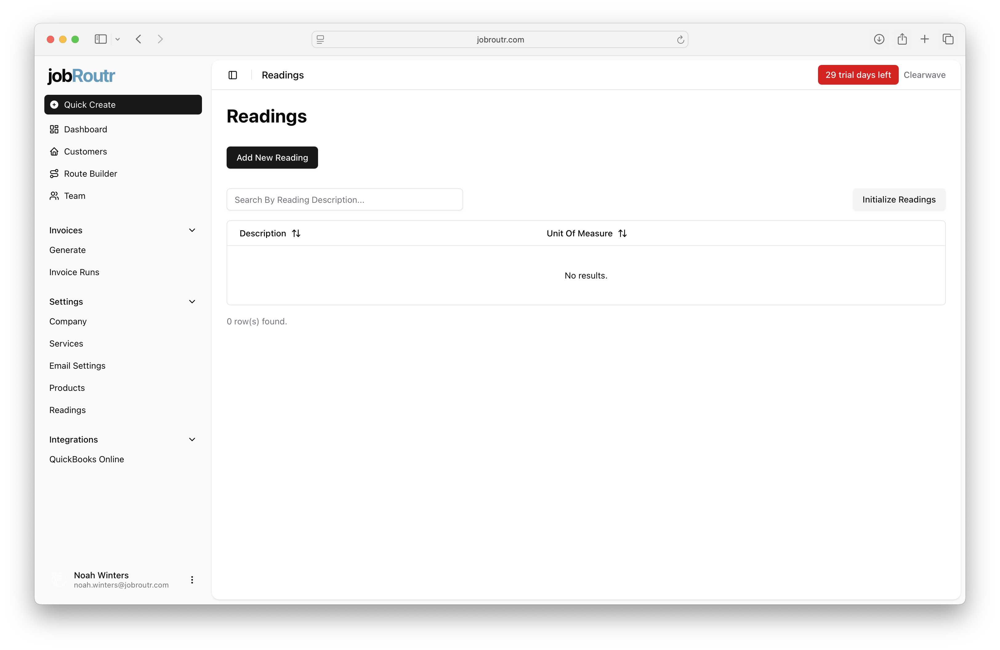
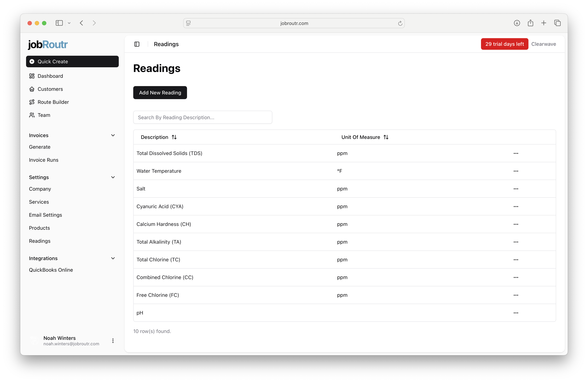
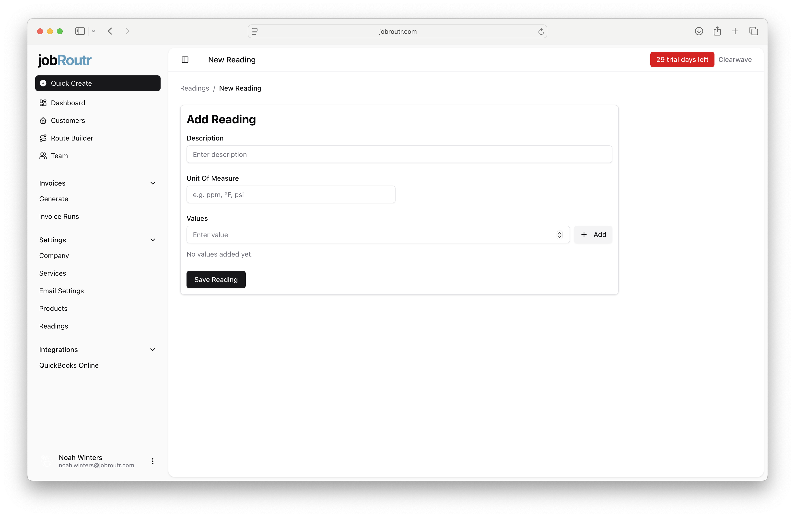

# Readings

Readings allow you to track water chemistry measurements at your customer pool sites. This includes parameters like pH, chlorine levels, water temperature, and other water quality indicators that you measure during service visits.



## Overview

The Readings feature enables you to:

- Initialize standard pool chemistry readings with one click
- Add custom reading types for any additional measurements you track
- Define units of measure for each reading
- Search and manage all your readings in one place

## Accessing Readings

1. Navigate to **Settings** in the left sidebar
2. Click on **Readings**

## Getting Started

### Initialize Standard Pool Readings

When you first set up JobRoutr, you can quickly create all the standard pool chemistry readings you need:

1. Click the **Initialize Readings** button in the top-right corner
2. The following 10 common pool service readings will be automatically created:

- **Total Dissolved Solids (TDS)** - ppm
- **Water Temperature** - °F
- **Salt** - ppm (for saltwater pools)
- **Cyanuric Acid (CYA)** - ppm
- **Calcium Hardness (CH)** - ppm
- **Total Alkalinity (TA)** - ppm
- **Total Chlorine (TC)** - ppm
- **Combined Chlorine (CC)** - ppm
- **Free Chlorine (FC)** - ppm
- **pH** - (no unit)



Once initialized, these readings are immediately available for use during service visits. You can edit or delete any readings you don't need, or add additional custom readings.

## Adding or Editing a Reading

To add a new reading or edit an existing one:

1. Click **Add New Reading** (or select **Edit** from a reading's menu ⋯)
2. Fill in the reading details:



### Description

Enter a clear name for the reading. Include abbreviations in parentheses if commonly used.

**Examples:**
- `Total Dissolved Solids (TDS)`
- `Water Temperature`
- `pH`
- `Free Chlorine (FC)`

### Unit Of Measure

Specify the measurement unit. Common units for pool chemistry:

- `ppm` - Parts per million (most chemistry readings)
- `°F` - Degrees Fahrenheit (temperature)
- Leave blank for dimensionless readings like pH

### Values (Optional)

Add preset values that technicians can quickly select in the field. This speeds up data entry and ensures consistency.

**Example preset values for pH:**
```
6.8
7.0
7.2
7.4
7.6
7.8
8.0
```

To add values:
1. Type a value in the "Enter value" text box
2. Click **+ Add** or press Enter
3. Repeat for additional values


3. Click **Save Reading** to save your changes

## Managing Your Readings

### Searching

Use the search box to quickly find specific readings by description.

### Editing or Deleting

Click the menu button (⋯) next to any reading to:
- **Edit** - Modify the description, unit, or preset values
- **Delete** - Remove the reading (only if not actively in use)

## Using Readings in the Field

Once configured, readings are available to technicians during service visits:

- Technicians record measurements for each customer pool
- Reading data appears in service reports sent to customers
- Historical data helps identify trends and water quality issues

## Best Practices

### Setup
- Use **Initialize Readings** to quickly set up standard pool chemistry readings
- Delete readings you don't typically measure (e.g., Salt for non-saltwater pools)
- Add custom readings for any unique measurements your company tracks

## Need Help?

If you have questions about setting up or using readings, please contact support through the help menu or visit our [Support page](/support).
