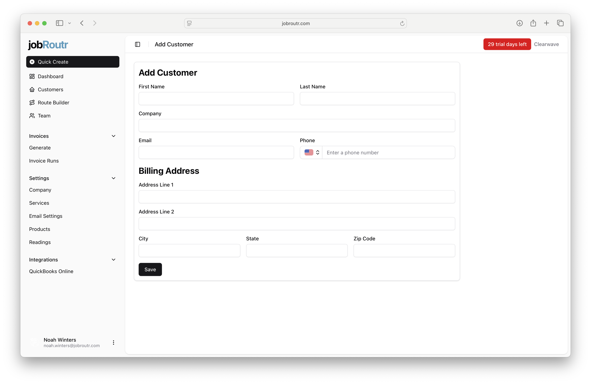
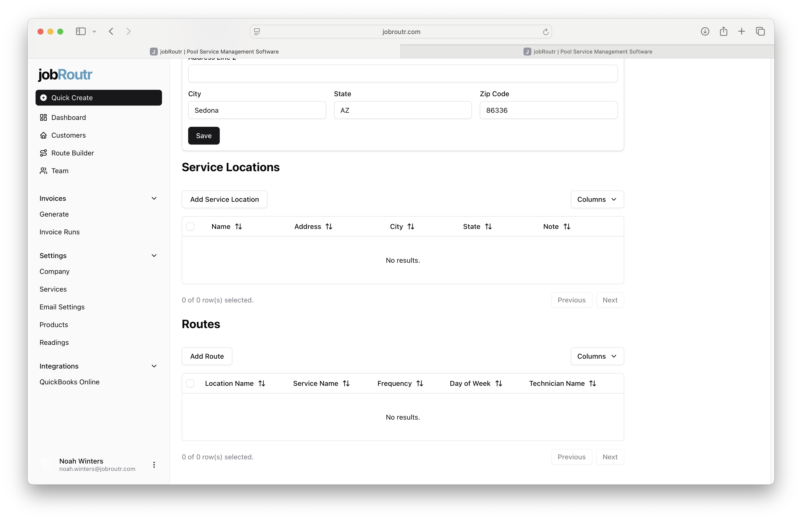
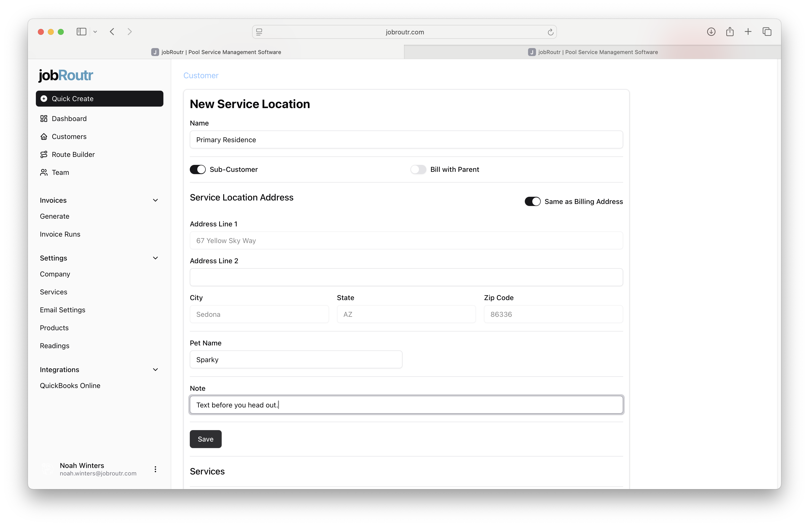
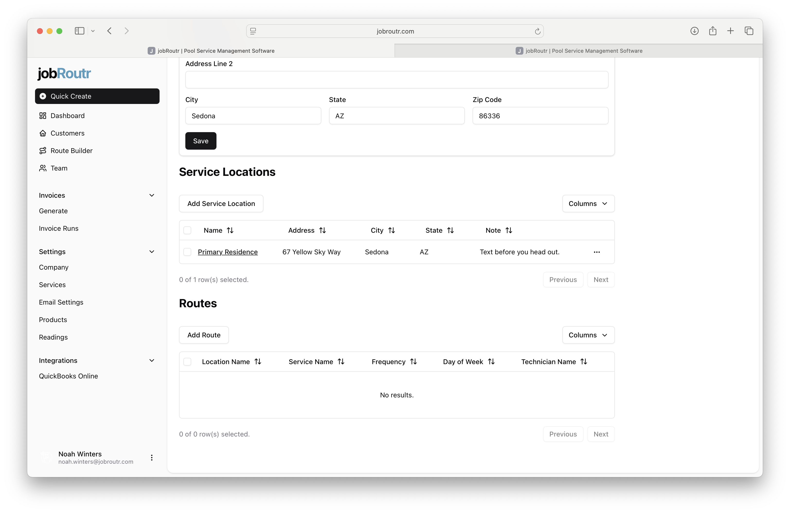
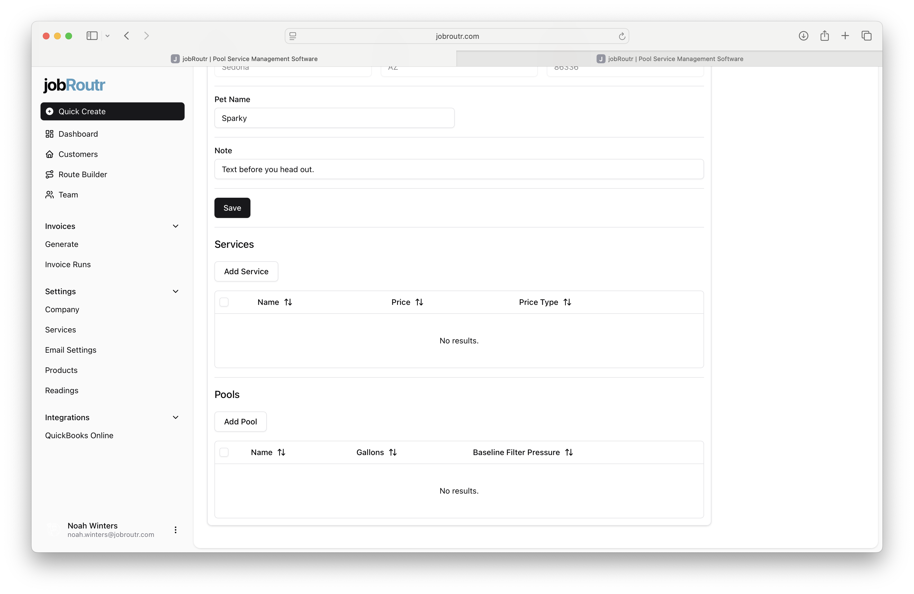
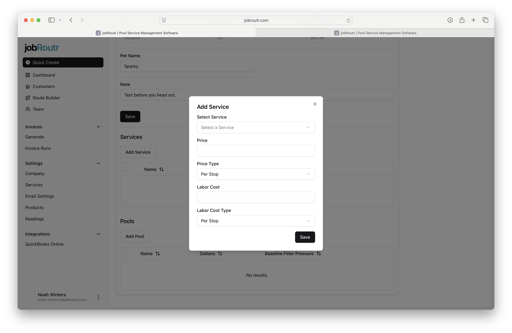
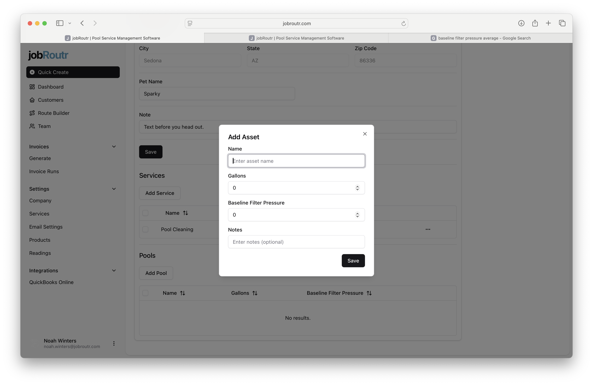

# Adding a New Customer

This guide walks you through the process of creating a new customer, adding service locations, configuring service overrides, and adding assets like pools.

## Step 1: Add Basic Customer Information

Start by entering the basic customer details including name, contact information, and billing address. Once you've filled in the required information, click **Save** to create the customer record.

## Step 2: Add a Service Location

After saving the customer, you'll need to add at least one service location. Click the **Add Service Location** button to begin.

## Step 3: Configure the Service Location

A **service location** is a physical address where services will be performed. This could be the same as the customer's billing address or a different property they own.

When configuring a service location:

- **Name**: Give the location a descriptive name (e.g., "Main Property", "Summer Home")
- **Sub-Customer**: Toggle this if the location should be treated as a separate customer in QuickBooks Online
- **Bill with Parent**: When enabled, services at this location will be billed to the parent customer
- **Same As Billing**: Toggle this to automatically copy the main customer's billing address

:::info Important
A jobRoutr customer can only have **one non-subcustomer address**. This address will be used as the shipping address in QuickBooks Online.
:::

## Step 4: View Service Locations

Once created, the service location will appear in the service location list on the customer page. You can manage multiple locations from this view.

## Step 5: Add Service Overrides

Navigate back into a service location to add **service overrides**. Service overrides allow you to customize the cost and pricing of specific services for this particular location, overriding the default service pricing.

## Step 6: Specify Override Values

Enter the custom cost and pricing values for the service at this location. This is useful when you have negotiated special rates or need location-specific pricing.

## Step 7: Service Override Created

After creating the service override, you'll see it listed for the service location. From here, you can also add assets like pools to this location.

## Step 8: Add an Asset (Pool)

Click to add an asset such as a pool to the service location. Enter relevant details about the pool including:

- Pool type and size
- Equipment information
- Maintenance notes
- Any other location-specific details

---

Your customer is now fully set up with service locations, custom pricing, and asset information. You can return to edit any of these details at any time from the customer management page.
