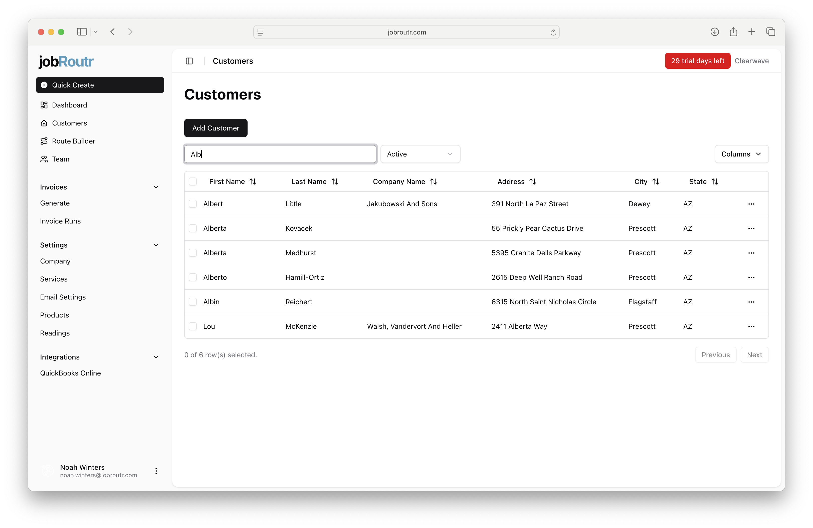

# Customers

The Customers screen is your central hub for managing all customer information in jobRoutr. From this screen, you can view, search, add, and edit customer records.

## Overview

The Customers screen displays a comprehensive list of all your customers in a sortable table format. Each customer record includes essential information such as:

- First Name
- Last Name
- Company Name
- Address
- City
- State

## Accessing the Customers Screen

To access the Customers screen:

1. Click on **Customers** in the left sidebar navigation menu
2. The customer list will load, displaying all customer records

## Searching for Customers

The search functionality allows you to quickly find specific customers in your database.

1. Locate the **Search by Name...** field at the top of the customer list
2. Type the customer's first name, last name, or company name
3. The list will automatically filter to show matching results

## Adding a New Customer

To add a new customer to your database:

1. Click the **Add Customer** button at the top of the customer list
2. Fill in the customer information form with the required details
3. Click **Save** to add the customer to your system

## Filtering Customers

You can filter your customer list to show only active or inactive customers.

1. Locate the **Active** filter dropdown at the top of the customer list
2. Select from the available options:
   - **Active** - Shows only currently active customers
   - **Inactive** - Shows only inactive customers
   - **All** - Shows all customers regardless of status

## Editing a Customer

To edit an existing customer record:

1. Locate the customer you want to edit in the list
2. Click the **three-dot menu icon (...)** on the right side of the customer row
3. Select **Edit** from the menu
4. Update the customer information as needed
5. Click **Save** to apply your changes

## Sorting Customer Data

You can sort the customer list by any column to organize your data:

1. Click on any column header (First Name, Last Name, Company Name, etc.)
2. Click once to sort in ascending order
3. Click again to sort in descending order
4. A sort indicator will appear next to the column name

## Customizing Column Display

The **Columns** dropdown menu (located at the top right) allows you to customize which columns are displayed in the customer list. This helps you focus on the information most relevant to your workflow.

## Customer List Navigation

At the bottom of the screen, you'll find pagination controls:

- **Previous** - Navigate to the previous page of customers
- **Next** - Navigate to the next page of customers
- The total count of customers is displayed (e.g., "100 of 800 row(s) selected")

## Tips

- Use the search function to quickly locate customers instead of scrolling through the entire list
- Regularly update customer status (Active/Inactive) to keep your database current
- Sort by Company Name when you need to find customers associated with a specific organization
- Use the column customization feature to create different views for different workflows
