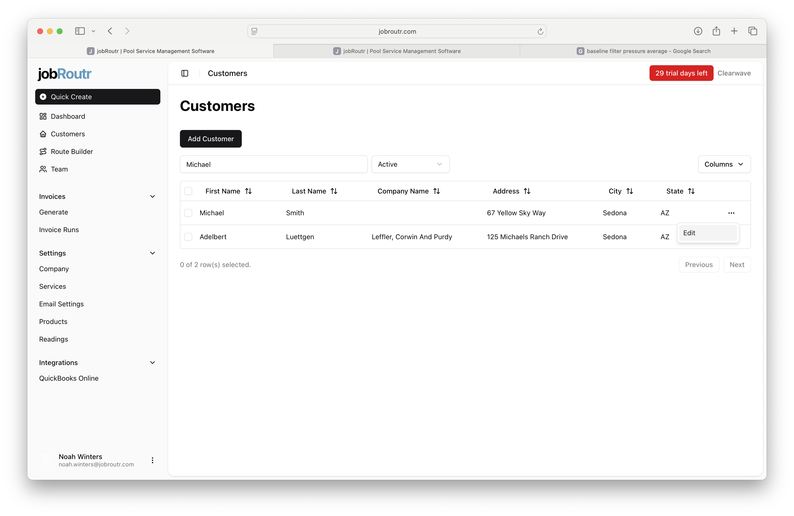
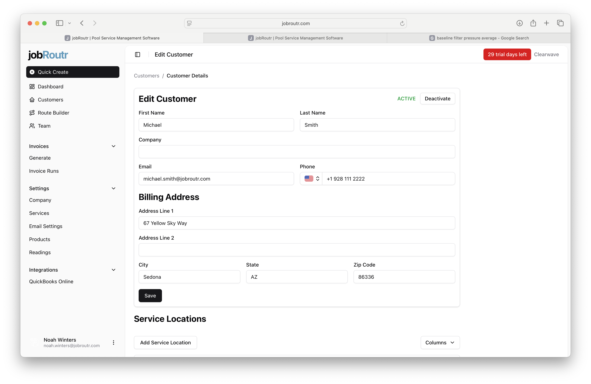
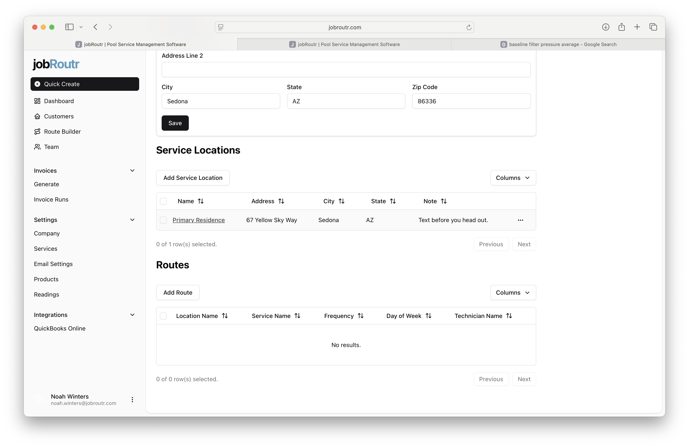
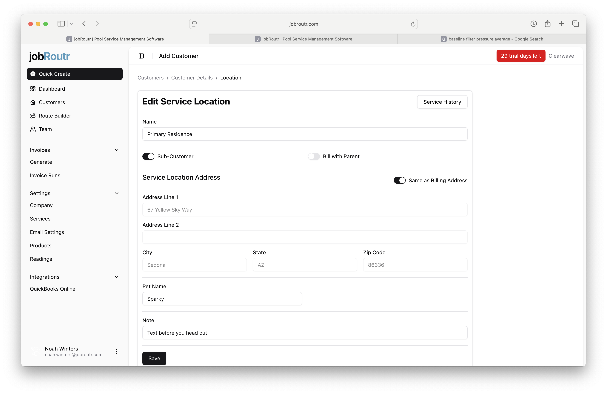
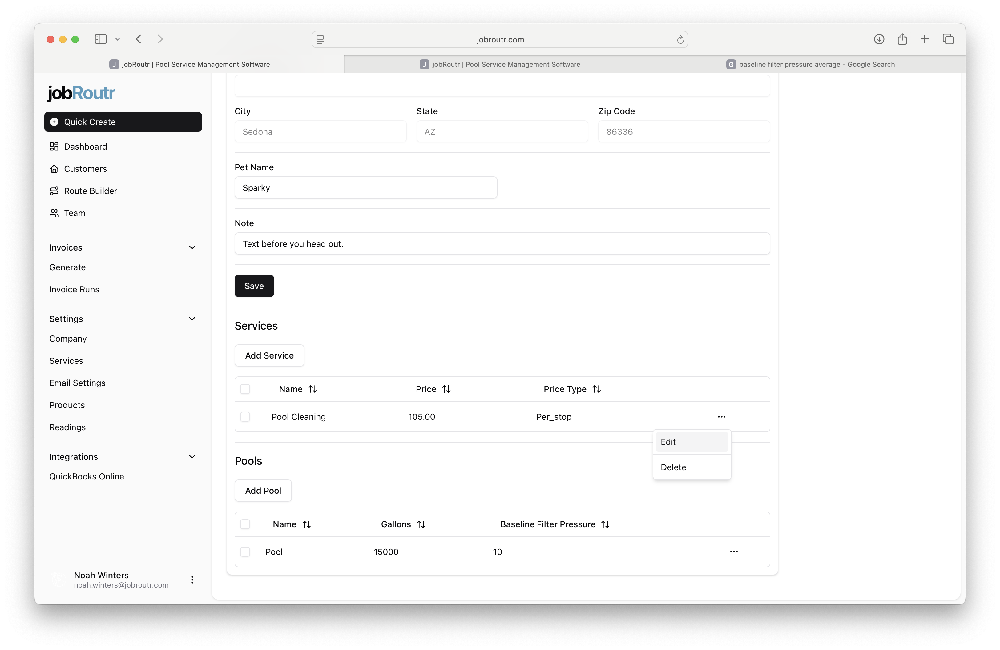
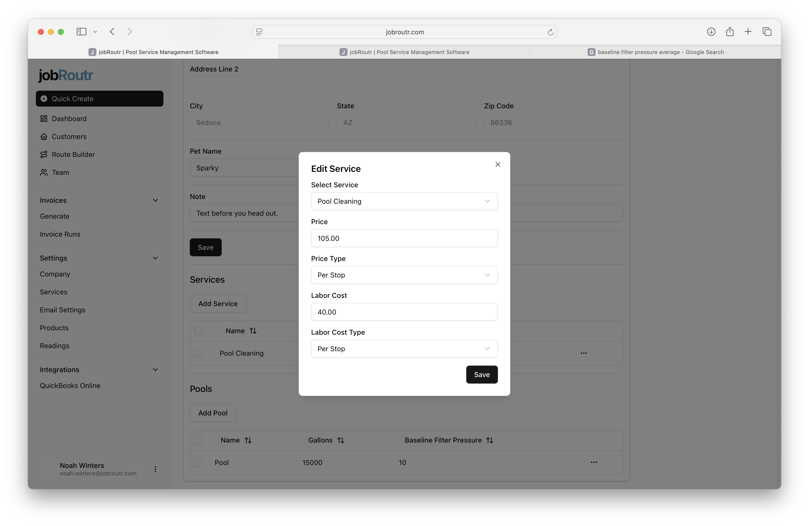
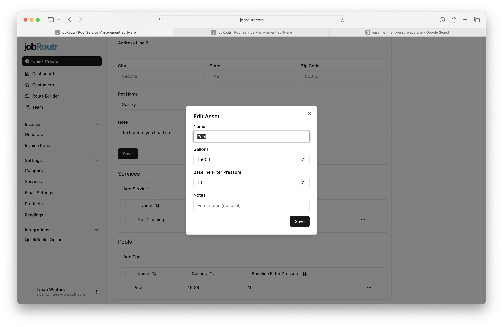

# Editing a Customer

This guide walks you through the process of editing existing customer information, managing service locations, updating service overrides, and modifying assets like pools.

## Step 1: Locate the Customer

From the **Customers** page, locate the customer you want to edit. You can search by name or filter by status. Once you find the customer, click the **Edit** option in their row.

## Step 2: Edit Customer Details

Update any customer details as needed, including:

- Name and contact information
- Email address and phone number
- Billing address
- Customer status (Active/Inactive)

After making your changes, click **Save**. 

:::info QuickBooks Sync
If QuickBooks integration is enabled, any changes you make will automatically sync to QuickBooks Online with the exception of active/inactive.
:::

## Step 3: Edit a Service Location

To edit an existing service location, scroll down to the **Service Locations** section and click on the location name link to access the service location details.

## Step 4: Update Service Location Details

When editing a service location, you can modify:

- **Name**: The descriptive name for this location
- **Sub-Customer**: Toggle this option to determine if a separate customer will be created in QuickBooks Online
- **Bill with Parent**: When enabled along with Sub-Customer, invoices for this location will be combined with the parent customer's billing
- **Same as Billing Address**: Toggle this to automatically use the customer's billing address as the service location address
- **Service Location Address**: The physical address where services are performed
- **Pet Name**: If applicable, the name of any pets at the location
- **Note**: Any special instructions or notes for this location

:::info QuickBooks Integration
Only **one non-subcustomer address** can be created per customer. This address will be stored as the shipping address in QuickBooks Online. All other service locations must be marked as sub-customers.
:::

After making changes, click **Save** to update the service location.

## Step 5: Manage Service Overrides

Service overrides allow you to set location-specific pricing and costs for services. In the **Services** section of the service location, you can:

- **Add Service**: Click to add a new service override
- **Edit**: Modify an existing service override
- **Delete**: Remove a service override

Service overrides are useful when you have negotiated special rates or need custom pricing for specific locations.

## Step 6: Edit Service Details

When editing a service override, you can customize:

- **Select Service**: Choose which service this override applies to
- **Price**: The customer-facing price for this service at this location
- **Price Type**: How the price is calculated (e.g., Per Stop, Per Hour, Flat Rate)
- **Labor Cost**: Your internal cost for labor
- **Labor Cost Type**: How the labor cost is calculated

Click **Save** to apply the service override changes.

## Step 7: Manage Pools (Assets)

In the **Pools** section of the service location, you can manage pool assets:

- **Add Pool**: Create a new pool asset
- **Edit**: Modify existing pool information
- **Delete**: Remove a pool from the location

Each service location can have multiple pools associated with it.

## Step 8: Edit Pool Information

When editing a pool, you can update:

- **Name**: A descriptive name or identifier for the pool
- **Gallons**: The pool capacity in gallons
- **Baseline Filter Pressure**: The normal operating pressure for the pool filter (measured in PSI)
- **Notes**: Any additional information about the pool, equipment, or special considerations

Click **Save** to update the pool information.

---

You can edit customer information at any time. All changes are saved immediately and will sync to QuickBooks Online if the integration is enabled. Regular updates help maintain accurate records for billing, scheduling, and service delivery.
