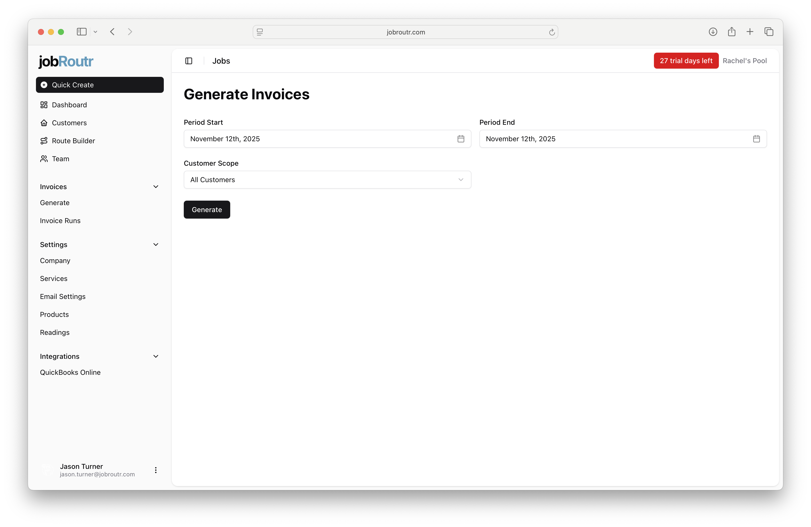
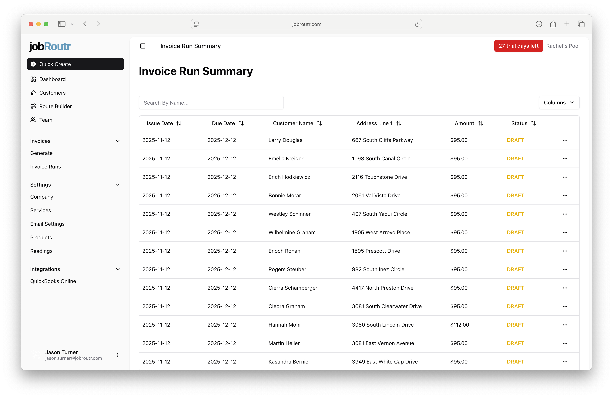
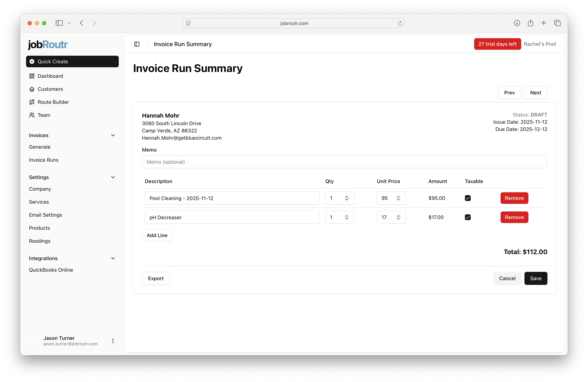
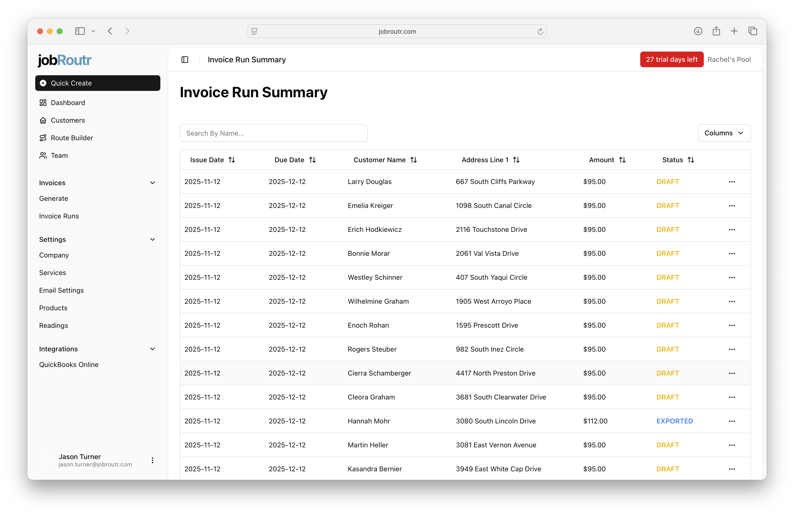

# Generating Invoices

This guide walks you through the complete invoice generation process in jobRoutr, from selecting the billing period to exporting invoices to QuickBooks Online.

## Step 1: Configure Invoice Generation Settings

Navigate to **Invoices** > **Generate** from the sidebar to access the invoice generation page.

Configure the following settings:

- **Period Start**: Select the beginning date for the billing period
- **Period End**: Select the ending date for the billing period
- **Customer Scope**: Choose whether to generate invoices for all customers or select specific customers

Once you've configured your settings, click the **Generate** button to create draft invoices.

:::tip
The date range you select will determine which services are included in the invoice run. All completed services within this period will be billed to the respective customers.
:::

## Step 2: Review the Invoice Run Summary

After generation completes, you'll be redirected to the **Invoice Run Summary** page. This page displays all draft invoices created during the generation process.

The summary table shows:

- **Issue Date**: The date the invoice was created
- **Due Date**: When payment is expected (typically 30 days from issue date)
- **Customer Name**: The customer being invoiced
- **Address Line 1**: The customer's billing address
- **Amount**: The total invoice amount
- **Status**: Current invoice status (DRAFT, EXPORTED, etc.)

You can search for specific customers using the search bar or sort by any column to organize the view.

## Step 3: Preview and Edit Invoice Details

Click on any invoice in the summary to open the invoice preview and make adjustments if needed.

The invoice preview displays:

- **Customer Information**: Name, address, and contact details
- **Invoice Dates**: Issue date, due date, and current status
- **Memo**: Optional note that will appear on the invoice
- **Line Items**: Detailed breakdown of services and products
  - Description
  - Quantity (Qty)
  - Unit Price
  - Total Amount
  - Taxable indicator

### Making Adjustments

You can make the following changes to draft invoices:

- **Add a memo**: Enter an optional message in the Memo field
- **Edit quantities**: Adjust the quantity for any line item
- **Edit unit prices**: Modify pricing as needed
- **Add line items**: Click **Add Line** to include additional services or products
- **Remove line items**: Click the **Remove** button next to any line item
- **Mark items as taxable**: Check or uncheck the taxable indicator

When you're finished making adjustments, click **Save** to preserve your changes.

:::info
The invoice total updates automatically as you make changes to quantities, prices, or line items.
:::

:::note
Tax calculations are handled by QuickBooks Online based on your tax settings and the taxable status of line items. The tax amount will be calculated and applied when the invoice is exported to QuickBooks.
:::

## Step 4: Export to QuickBooks Online

Once you've reviewed and saved your invoice, click the **Export** button to send the invoice to QuickBooks Online.

After a successful export:

- The invoice status will change from **DRAFT** to **EXPORTED**
- The invoice is now synced with QuickBooks Online
- You can view the exported invoice in both jobRoutr and QuickBooks

:::warning Important
Once an invoice has been exported to QuickBooks Online, you should make any further changes directly in QuickBooks to maintain sync integrity.
:::

## Navigation Between Invoices

Use the **Prev** and **Next** buttons at the top of the invoice preview to move between invoices in the current run without returning to the summary page.

## Next Steps

After exporting your invoices:

1. Monitor payment status in QuickBooks Online
2. Send invoices to customers through QuickBooks
3. Track which invoices have been paid
4. Follow up on outstanding invoices as they approach their due dates

You can return to the Invoice Run Summary at any time by navigating to **Invoices** > **Invoice Runs** from the sidebar.
