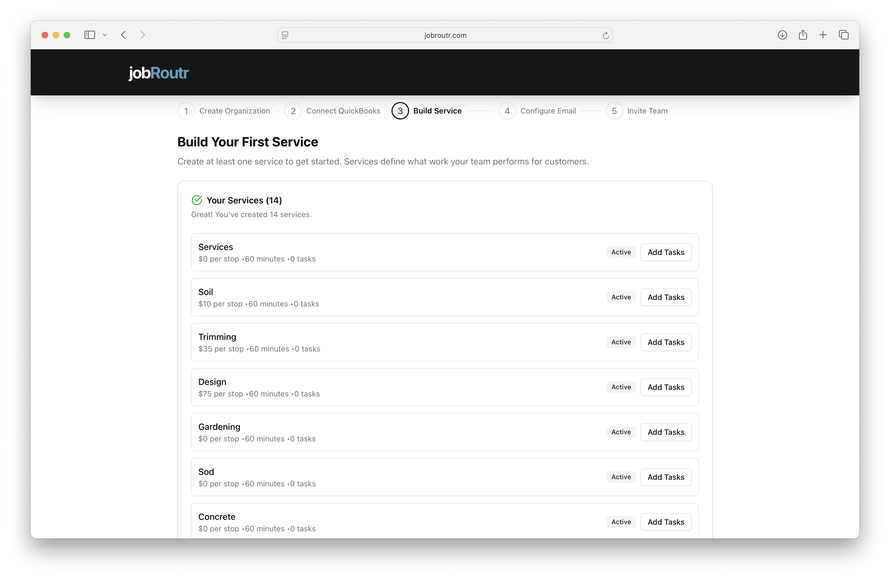
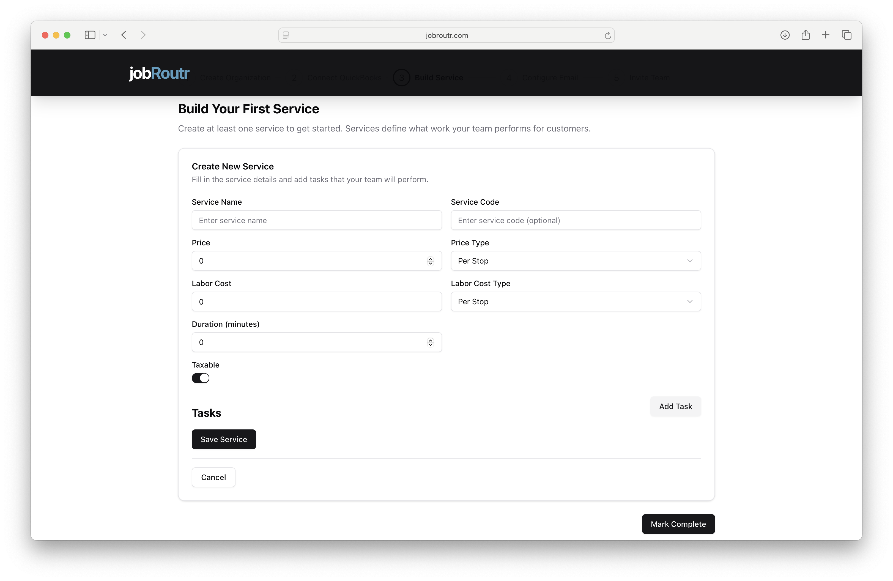
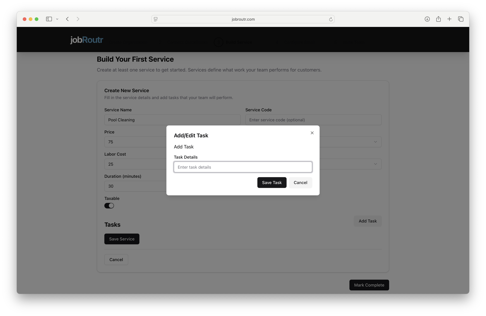
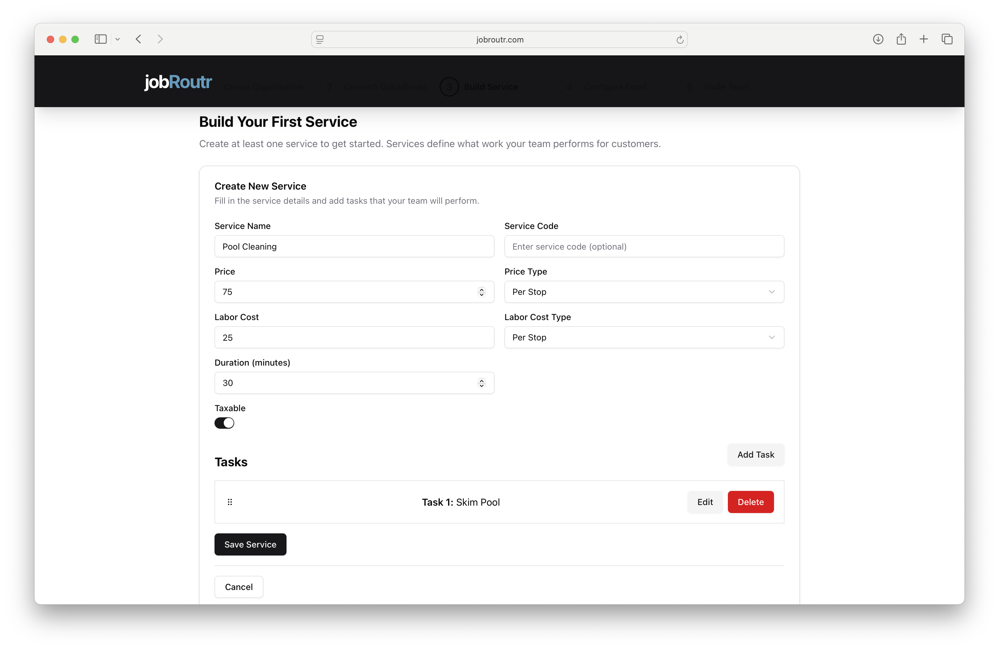
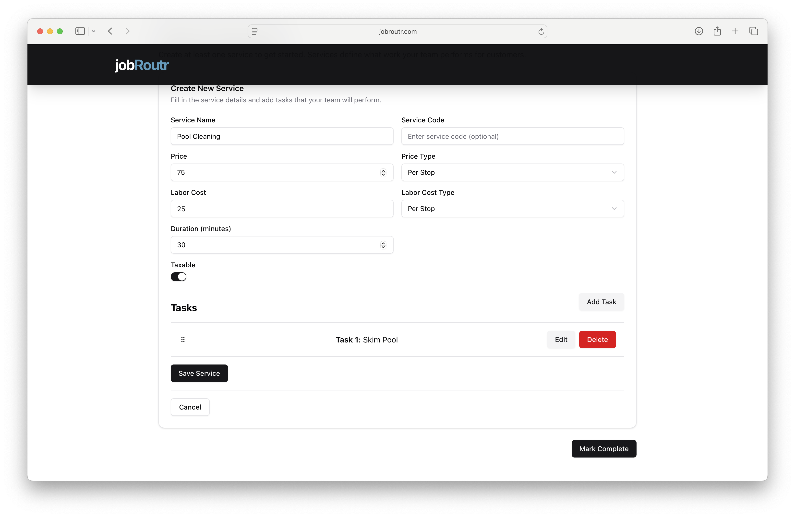

# Build Your First Service

Services are the foundation of your JobRoutr workflow. They define what work your team performs for customers, including pricing, duration, and the specific tasks involved in completing each service.

## Overview

This is **Step 3 of 5** in the onboarding process. In this step, you'll:
- Review services imported from QuickBooks (if applicable)
- Create new custom services
- Add tasks to each service
- Configure pricing and duration settings

## Why Services Matter

Services help you:
- **Standardize operations** - Define consistent workflows for your team
- **Accurate pricing** - Set clear pricing structures for different service types
- **Task management** - Break down services into actionable tasks
- **Efficient scheduling** - Estimate job duration for better scheduling
- **Customer clarity** - Provide clear service descriptions to customers

## Getting Started

When you first access the Build Service page, you'll see one of two scenarios:

### Scenario 1: Services Imported from QuickBooks

If you connected QuickBooks Online and imported products, your services will be displayed here. Each service shows:
- Service name
- Price per stop/monthly
- Estimated duration
- Number of tasks (initially 0)
- **Add Tasks** button

You can customize these imported services by adding tasks and adjusting details.

### Scenario 2: No Services Yet

If you haven't imported services or want to start fresh, you'll see the "Create New Service" section with instructions to build your first service.

Click the **+ Create New Service** button to begin.

## Creating a New Service

### Step 1: Fill in Service Details

When creating or editing a service, complete the following fields:

#### Service Name (Required)
Enter a clear, descriptive name for your service.
- Examples: "Pool Cleaning", "Chemical Reading"
- Keep it customer-friendly and specific

#### Service Code (Optional)
Add an internal reference code for tracking purposes.
- Examples: "PC-001", "CR-001"
- Useful for reporting and integration with other systems

#### Price (Required)
Enter the price for this service.
- Must be a numeric value
- Can include decimals (e.g., 75.00)

#### Price Type (Required)
Select how the service is priced from the dropdown:
- **Per Stop** - Flat rate per service visit
- **Per Month** - Flat rate per month

<!-- :::tip Pricing Best Practices
Choose "Per Stop" for fixed-price services like pool cleaning or lawn mowing. Use "Per Hour" for services with variable time requirements like repairs or consulting.
::: -->

#### Labor Cost (Required)
Enter the cost of labor for this service.
- Used for profit margin calculations
- Helps track profitability per service
- Not visible to customers

#### Labor Cost Type (Required)
Select how labor costs are calculated:
- **Per Stop** - Fixed labor cost per visit
- **Per Month** - Labor cost per month

#### Duration (minutes) (Required)
Estimate how long this service typically takes in minutes.
- Used for scheduling and route planning
- Examples: 30, 60, 90, 120
- Can be adjusted later based on actual performance

#### Taxable (Toggle)
Enable if this service is subject to sales tax.
- Toggle **ON** (enabled) for taxable services
- Toggle **OFF** (disabled) for non-taxable services
- Depends on your local tax regulations

### Step 2: Add Tasks

Tasks are the individual actions your team performs when completing a service. Adding tasks helps:
- **Guide technicians** through the service workflow
- **Ensure consistency** across all team members
- **Track completion** of critical steps
- **Quality control** and accountability

#### To Add a Task:

1. Click the **Add Task** button in the Tasks section
2. A dialog will appear for task entry

3. In the "Task Details" field, enter a clear description of the task
   - Examples: "Skim Pool", "Check Chemical Levels", "Clean Filter"
   - Be specific and action-oriented
   - Keep it concise but clear

4. Click **Save Task** to add it to the service

#### Managing Tasks

Once added, tasks appear in a list with:
- **Drag handle** (⋮⋮) - Reorder tasks by dragging
- **Task number and name** - e.g., "Task 1: Skim Pool"
- **Edit** button - Modify task details
- **Delete** button (red) - Remove the task

:::info Task Order Matters
Tasks are displayed to technicians in the order you set them. Arrange tasks in the logical sequence they should be performed.
:::

**Example Task List for Pool Cleaning:**
1. Task 1: Skim Pool
2. Task 2: Brush Walls and Floor
3. Task 3: Vacuum Pool
4. Task 4: Empty Skimmer Basket
5. Task 5: Check Chemical Levels
6. Task 6: Add Chemicals if Needed

### Step 3: Save Your Service

After completing all required fields and adding tasks:

1. Click the **Save Service** button at the bottom of the form
2. Your service will be saved and added to your service list
3. The form will close and return you to the services overview

If you need to cancel without saving, click the **Cancel** button.

:::warning Don't Forget to Save!
Changes are not saved automatically. Always click "Save Service" before closing the form or navigating away.
:::

## Managing Your Services

### Services List Overview

After creating services, you'll see them listed with:
- **Service name**
- **Price** (e.g., "$35 per stop")
- **Duration** (e.g., "60 minutes")
- **Number of tasks** (e.g., "0 tasks")
- **Add Tasks** button - Quick access to add tasks

### Adding Tasks to Existing Services

For imported or previously created services without tasks:

1. Locate the service in the list
2. Click the **Add Tasks** button on the right
3. Follow the task creation process described above
4. Save your changes

### Creating Additional Services

At any time, you can create more services:

1. Scroll to the "Create New Service" section
2. Click **+ Create New Service**
3. Fill in the service details
4. Add tasks
5. Save the service

:::tip How Many Services Should I Create?
Create at least one service to get started, but ideally, add all your common service offerings. You can always add more services later from the Services menu.
:::

## Completing This Step

When you've finished customizing your services:

1. Review your service list to ensure all necessary services are added
2. Verify that tasks are added to your primary services
3. Click the **Mark Complete** button in the bottom right
4. You'll proceed to **Step 4: Configure Email**

:::info Minimum Requirement
You should have at least one service created before marking this step complete. This ensures you can start creating jobs and scheduling work.
:::

## Tips for Success

### Pricing Strategy
- **Research competitors** - Know the market rates in your area
- **Cover costs** - Ensure labor costs plus overhead are covered
- **Value-based pricing** - Price based on value delivered, not just time
- **Round numbers** - $75 is easier than $73.47

### Task Creation
- **Be specific** - "Skim pool" is better than "Clean water"
- **Action verbs** - Start each task with a verb (Check, Clean, Inspect, Test)
- **Logical order** - Sequence tasks in the order they should be performed
- **Essential only** - Include critical tasks, not every minor detail
- **Consistency** - Use similar language across services

### Duration Estimates
- **Add buffer** - Better to overestimate slightly than underestimate
- **Consider complexity** - First-time services may take longer

### Service Organization
- **Start simple** - Begin with your most common services
- **Group related services** - Keep similar services together
- **Use clear names** - Names should be self-explanatory
- **Regular updates** - Review and update services quarterly

## Editing Services Later

You can edit services at any time after onboarding:

1. Navigate to **Services** from the main menu
2. Find the service you want to edit
3. Click the service name or **Edit** button
4. Make your changes
5. Click **Save**

## Common Questions

### Can I have different pricing for different customers?
Base service pricing is set here, but you can adjust pricing per service location or per job (override invoice).

### What if I don't know the exact duration?
Start with your best estimate. 

### Can I deactivate services I no longer offer?
Yes, from the Services menu, you can mark services as inactive. They won't appear in new job creation but remain in historical records.

### Do I need to add tasks?
Tasks are optional but highly recommended. They improve service consistency, help train new team members, and ensure quality control.

### Can I import more services later?
Yes, you can import additional products from QuickBooks at any time from Settings > Integrations > QuickBooks.

## Next Steps

After building your services, you'll move on to:
- [Configure Email](/docs/onboarding/configure-email.md) - Set up email notifications and templates

## Need Help?

If you need assistance building your services:
- Email: support@jobroutr.com
- Help Center: [help.jobroutr.com](https://help.jobroutr.com)
