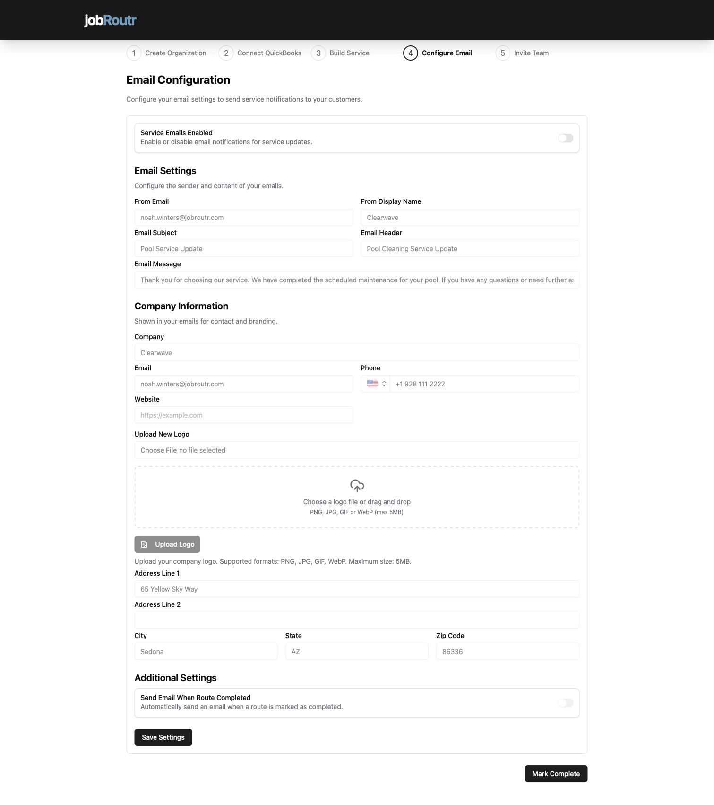

# Configure Email

Email configuration is a crucial step in setting up automated communication with your customers. JobRoutr can automatically send service reports to keep your customers informed throughout the service process.

## Overview

This is **Step 4 of 5** in the onboarding process. In this step, you'll:
- Enable or disable service email notifications
- Configure email settings (sender, subject, content)
- Set up your company branding and contact information
- Upload your company logo
- Configure automatic email triggers

## Service Emails Enabled

At the top of the page, you'll see the **Service Emails Enabled** toggle.

### Important: Email Control

- **Toggle ON** (enabled) - Emails will be sent to customers based on your configured triggers
- **Toggle OFF** (disabled) - **No emails will be sent**, regardless of other settings

:::warning Critical Setting
If this toggle is disabled, JobRoutr will NOT send any service emails to customers, even if other email settings are configured. Make sure to enable this when you're ready to start communicating with customers.
:::

**When to Keep It Disabled:**
- During initial setup and testing
- When you want to manually control all customer communication
- If you're not ready to send automated emails yet

**When to Enable It:**
- When your email templates are finalized
- After testing your email content
- When you're ready for automated customer communication

## Email Settings

Configure how your emails appear to customers and what content they contain.

### From Email
**Pre-filled from organization details**

This is the email address that appears in the "From" field when customers receive emails.
- Typically your business email (e.g., `joakvarnian@cleanave.com`)
- Should be a monitored email address for customer replies
- Can be overridden if needed

:::tip Professional Email
Use a professional business email address (not personal Gmail/Yahoo) to build trust with customers.
:::

### From Display Name
The name that appears alongside your email address.
- Example: "Clearwave", "Pool Service Team", "ACME Support"
- This is what customers see first in their inbox
- Keep it recognizable and professional

### Email Subject
**Pre-filled with suggested text**

The subject line of the service notification email.
- Default: "Pool Service Update" 
- Customize to match your communication style
- Keep it clear and relevant
- Examples:
  - "Your Pool Service is Complete"
  - "Service Update from [Company Name]"
  
### Email Header
A headline that appears at the top of the email body.
- Example: "Pool Cleaning Service Update"
- Sets the context for the email content
- Should match or complement the subject line

### Email Message
The main body text of your service email.
- Pre-filled with a professional template
- Example: "Thank you for choosing our service. We have completed the scheduled maintenance for your pool. If you have any questions or need further assistance, please contact us."
- Customize to match your brand voice
- Keep it concise and customer-focused
- Include relevant service information

:::tip Email Content Best Practices
- Be clear and concise
- Thank the customer
- Confirm what was completed
- Provide next steps or contact information
- Maintain a professional but friendly tone
:::

## Company Information

This section displays your company details in customer emails for contact and branding purposes. **These fields are automatically pre-filled** from the organization details you provided in Step 1.

### Company
Your business name as it appears to customers.
- Pre-filled from your organization setup
- Example: "Clearwave"
- Can be updated if needed

### Email
Your business contact email address.
- Pre-filled from organization details
- Used for customer replies and inquiries
- Example: `joakvarnian@clearwave.com`

### Phone
Your business phone number.
- Pre-filled from organization setup
- Displayed in email footer for customer contact
- Format example: `+1 928 111 2222`

### Website
Your company website URL.
- Pre-filled if provided during organization setup
- Example: `www.clearwave.com`
- Customers can click to visit your site
- Optional but recommended for credibility

### Upload New Logo

Add your company logo to appear in customer emails for professional branding.

#### How to Upload:

1. Click the **Upload Logo** button or drag and drop area
2. Choose a logo file from your computer
3. Or drag and drop your logo file into the upload area

**Supported Formats:**
- PNG (recommended for transparency)
- JPG/JPEG
- GIF

**Maximum File Size:** 5MB

:::tip Logo Best Practices
Use a high-quality logo with good contrast. A transparent PNG works best for email templates. Avoid logos with very fine details that may not display well at smaller sizes.
:::

### Address Information

Your business address appears in the email footer for professional communication and legal compliance.

#### Address Line 1
Pre-filled from organization setup.
- Example: "66 Yellow Sky Way"
- Your primary business street address

#### Address Line 2 (Optional)
Additional address information if needed.
- Suite, apartment, or building numbers
- Department or floor information

#### City
Pre-filled from organization details.
- Example: "Sedona"

#### State
Pre-filled from organization setup.
- Dropdown selection
- Example: "AZ" (Arizona)

#### Zip Code
Pre-filled from organization details.
- Example: "86336"
- 5-digit or 9-digit ZIP code

:::info Why Address Information?
Including your business address in emails adds credibility and may be required by email regulations (like CAN-SPAM Act in the US) for commercial communications.
:::

## Additional Settings

### Send Email When Route Completed

This toggle controls automatic email sending when service is marked as 'Completed'.

- **Toggle ON** - Automatically send a service report email when a stop/service is marked as completed
- **Toggle OFF** - Do not automatically send emails; send manually if needed

**Benefits of Auto-Send:**
- ✓ Immediate customer notification
- ✓ Professional automated workflow
- ✓ Reduces manual follow-up work
- ✓ Keeps customers informed in real-time
- ✓ Builds trust through transparency

**When to Use Auto-Send:**
Most businesses should enable this feature for efficient customer communication. It ensures customers are notified immediately when work is complete.

**When to Send Manually:**
Disable auto-send if you want to review service details before sending customer notifications, or if you need to add custom notes to each email.

:::tip Recommended Setting
We recommend enabling "Send Email When Route Completed" for streamlined operations. Customers appreciate timely updates, and automation saves your team time.
:::

## Saving Your Configuration

After completing all settings:

1. Review all fields for accuracy
2. Ensure your company information is correct
3. Verify your email content is professional and error-free
4. Click the **Save Settings** button at the bottom of the page
5. A confirmation message will appear when settings are saved

:::warning Save Your Changes
Settings are not saved automatically. Always click "Save Settings" before leaving the page or moving to the next step.
:::

## Completing This Step

After saving your email configuration:

1. Review your settings one final time
2. Test sending an email if possible
3. Click the **Mark Complete** button in the bottom right
4. You'll proceed to **Step 5: Invite Team**

## Email Configuration Checklist

Before marking this step complete, verify:

- [ ] Service Emails Enabled toggle is set to your preference
- [ ] From Email is a valid, monitored email address
- [ ] From Display Name represents your business professionally
- [ ] Email Subject is clear and relevant
- [ ] Email Message is customized and error-free
- [ ] Company information is accurate and complete
- [ ] Logo is uploaded (optional but recommended)
- [ ] Address information is correct
- [ ] Auto-send preference is configured
- [ ] Settings are saved

## Testing Your Email Configuration

After setup, it's important to test your email configuration:

1. Complete a test service/stop
2. Check that the email is sent (if auto-send is enabled)
3. Review the email appearance and content
4. Verify all information displays correctly
5. Check that links and contact information work

:::tip Test Before Go-Live
Consider sending test emails to your own address first to ensure everything looks professional and functions correctly.
:::

## Common Questions

### Can I change these settings later?
Yes! You can update email settings at any time from **Settings** > **Email Configuration**.

### What happens if I don't upload a logo?
Emails will still be sent, but they'll appear without your company logo. We recommend adding a logo for professional branding.

### Can I have different email templates for different services?
Currently, this configuration applies to all service emails. Custom templates per service may be available in advanced settings.

### Will customers see my personal email address?
No, only the "From Email" address you configure here will be visible to customers. Replies will go to this address.

### Can I customize the email design/layout?
The layout is standardized for consistency, but you can customize the content (subject, message, header) and branding (logo, company info).

### What if my organization information changes?
Update your organization details in **Settings** > **Organization**, and those changes will automatically populate in your email configuration.

<!-- ### How do I know if an email was sent?
JobRoutr logs all email activity. You can check email status in the job/stop history or email logs section. -->

<!-- ### Can I send emails in different languages?
Currently, email content is based on what you enter in these fields. For multi-language support, you may need to create separate templates or customize per customer. -->

## Email Best Practices

### Subject Lines
- Keep it under 50 characters
- Be specific and clear
<!-- - Include service type or action -->
- Avoid spam trigger words (FREE, URGENT, etc.)

### Branding
- **Consistent logo** - Use the same logo across all platforms
- **Color scheme** - Emails should match your brand colors
- **Professional tone** - Match your company's voice

### Timing
- **Immediate updates** - Enable auto-send for timely notifications
- **Business hours** - Consider customer preferences
- **Frequency** - Don't overwhelm with too many emails

## Troubleshooting

### Emails Not Sending
- Verify **Service Emails Enabled** toggle is ON
- Check that "From Email" is valid
- Ensure you clicked "Save Settings"
- Verify customer email addresses are correct

<!-- ### Emails Going to Spam
- Use a professional business email domain
- Include complete address information
- Add unsubscribe option (handled automatically)
- Avoid spam trigger words in subject/content -->

### Logo Not Displaying
- Verify file is under 5MB
- Use supported formats (PNG, JPG, GIF, WebP)
- Try re-uploading with a smaller file size
- Clear browser cache and refresh

### Wrong Information in Emails
- Update organization details in Settings
- Refresh the email configuration page
- Save settings again after updates

## Next Steps

After configuring email settings, proceed to:
- [Invite Team](/docs/onboarding/invite-team.md) - Add team members to your organization (Final Step!)

Then you're ready to start using JobRoutr:
- Create your first customer
- Schedule your first job
- Start routing and dispatching work

## Need Help?

For email configuration assistance:
- Email: support@jobroutr.com
- Help Center: [help.jobroutr.com](https://help.jobroutr.com)
- Live Chat: Available in the bottom right corner of your dashboard
