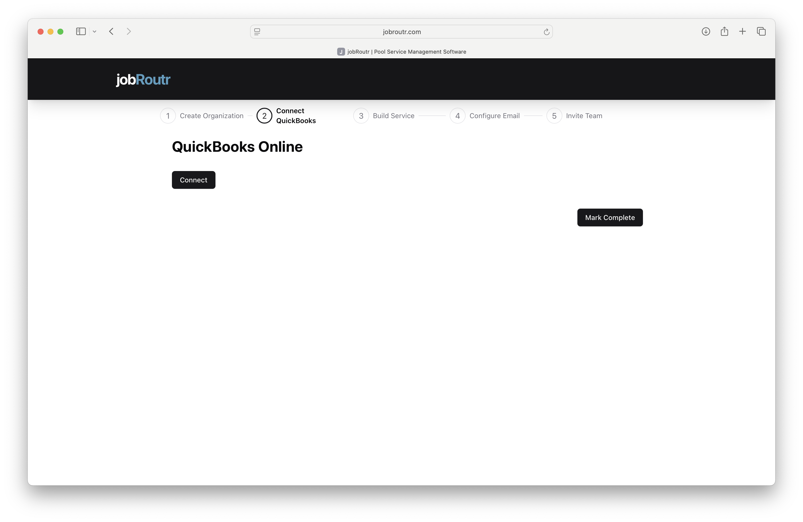
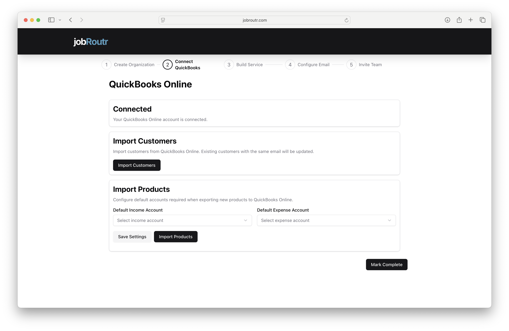

# Connect QuickBooks Online

Integrating JobRoutr with QuickBooks Online allows you to seamlessly sync customers, products, and invoice data between both systems. This step is crucial for maintaining accurate accounting records.

## Overview

The QuickBooks integration process includes:
1. **Connect to QuickBooks Online** (Step 2 of 5)
2. Import Customers
3. Configure Default Accounts
4. Import Products

## Step 1: Connect to QuickBooks Online

### Initial Connection

1. On the QuickBooks Online page, click the **Connect** button
2. You'll be redirected to the QuickBooks Online login page
3. Log in with your QuickBooks Online credentials
4. Review and accept the permissions requested by JobRoutr
5. You'll be automatically redirected back to JobRoutr

**What Permissions Are Required?**
JobRoutr needs access to:
- Read and write customer information
- Read and write products and services
- Read and write invoices
- Read chart of accounts

:::tip
If you're not already logged into QuickBooks Online, make sure you have your credentials ready before clicking Connect.
:::

## Step 2: After Connection

Once connected, you'll see a confirmation message: "Your QuickBooks Online account is connected."

Now you can proceed with importing your data and configuring settings.

## Import Customers

### What This Does
Imports all active customers from your QuickBooks Online account into JobRoutr. 

### Steps to Import
1. Click the **Import Customers** button in the "Import Customers" section
2. Wait for the import process to complete
3. A confirmation message will appear when finished

**Important Notes:**
- Only **active** customers are imported
- Customer contact information, addresses, and billing details are synced

:::info
The import process may take a few minutes depending on how many customers you have in QuickBooks Online.
:::

## Configure Default Accounts (Optional)

### Why Configure These Accounts?

When you create new products or services in JobRoutr, they need to be associated with income and expense accounts in QuickBooks Online. Setting default accounts ensures new products sync correctly.

### Default Income Account
Select the QuickBooks account where product/service revenue will be recorded.
- Common choices: "Sales Revenue", "Service Income", or "Product Sales"
- This will be used for all new products created in JobRoutr

### Default Expense Account
Select the QuickBooks account where product/service costs will be recorded.
- Common choices: "Cost of Goods Sold", "Service Costs", or "Direct Expenses"
- This will be used for expense tracking on new products

### How to Configure

1. Click the **Select income account** dropdown
2. Choose your default income account from your QuickBooks chart of accounts
3. Click the **Select expense account** dropdown
4. Choose your default expense account from your QuickBooks chart of accounts
5. Click **Save Settings** to save your selections

:::tip Optional but Recommended
While this step is optional, setting default accounts now will save time later. You can always change these values for individual products in QuickBooks Online after they're created.
:::

## Import Products

### What This Does
Imports all products and services from QuickBooks Online into JobRoutr. This ensures your service catalog matches your QuickBooks inventory.

### Steps to Import

1. **Configure default accounts first** (if you haven't already)
2. Click **Save Settings** to save your account selections
3. Click the **Import Products** button
4. Wait for the import process to complete
5. A confirmation message will appear when finished

**What Gets Imported:**
- Product/service names
- Descriptions
- Pricing information

:::warning
Make sure to click "Save Settings" before importing products if you've configured default accounts.
:::

## Complete This Step

Once you've completed the necessary actions:
1. Click the **Mark Complete** button in the bottom right
2. You'll proceed to **Step 3: Build Service**

## Troubleshooting

### Connection Failed
If the QuickBooks connection fails:
- Verify you're using a QuickBooks Online account (not QuickBooks Desktop)
- Check that you have admin permissions in QuickBooks Online
- Try clearing your browser cache and connecting again
- Ensure pop-ups are not blocked in your browser

### Import Takes Too Long
If customer or product import seems stuck:
- Large catalogs (500+ items) may take several minutes
- Refresh the page to check if import completed
- Contact support if import fails after 10 minutes

### Wrong Accounts Selected
You can change default accounts at any time:
- Go to **Settings** > **Integrations** > **QuickBooks**
- Update your account selections
- Click **Save Settings**

### Missing Products After Import
If products don't appear after import:
- Verify products are marked as active in QuickBooks Online
- Check that products have both a name and price set
- Inactive or incomplete products won't sync

## Can I Skip This Step?

While you can mark this step complete and move on, **we strongly recommend** completing the QuickBooks integration. Benefits include:
- Automatic invoice syncing
- Real-time financial data
- Reduced manual data entry
- Accurate accounting records

If you don't use QuickBooks Online, you can skip this step and manage customers/products directly in JobRoutr.

## What's Synced Going Forward?

After initial setup, the following data syncs automatically:
- **New customers** created in JobRoutr → QuickBooks Online
- **New products** created in JobRoutr → QuickBooks Online
- **Invoices** created in JobRoutr → QuickBooks Online
- **Customer updates** created in JobRoutr → QuickBooks Online 
- **QuickBooks Online Updates** must be imported again using import 

## Next Steps

After connecting QuickBooks, proceed to:
- [Build Service](/docs/intro) - Configure your service offerings

## Need Help?

For QuickBooks integration support:
- Email: support@jobroutr.com
- QuickBooks issues: Verify account status at [quickbooks.intuit.com](https://quickbooks.intuit.com)
- Help Center: [help.jobroutr.com](https://help.jobroutr.com)
