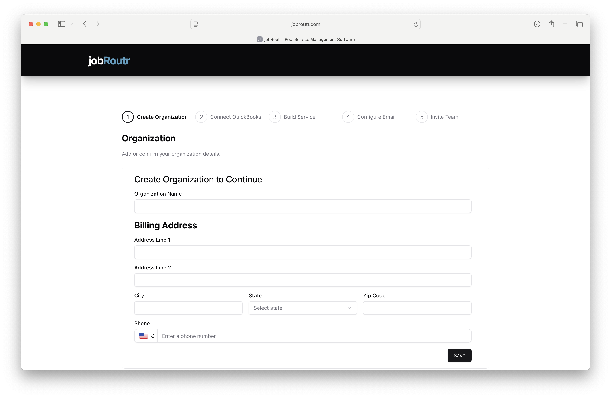

# Creating Your Organization

After creating your account, the next step is to set up your organization in JobRoutr. This is where you'll manage your company information and billing details.

## Overview

The organization setup process includes 5 steps:
1. **Create Organization** (Current Step)
2. Connect QuickBooks
3. Build Service
4. Configure Email
5. Invite Team

## Create Organization Form

## Steps to Create Your Organization

### 1. Organization Name

Enter your company or organization name in the **Organization Name** field. This will be displayed throughout the system and visible to your team members.

**Best Practices:**
- Use your official business name
- Avoid abbreviations unless commonly used
- Example: "Blue Circuit"

### 2. Billing Address

Complete all billing address fields to ensure accurate invoicing and service delivery.

#### Address Line 1
Enter your primary street address or building number.
- Example: "123 Main Street" or "Suite 200, 456 Business Blvd"

#### Address Line 2 (Optional)
Add additional address details if needed:
- Suite or apartment numbers
- Building names
- Department information

#### City
Enter the city where your organization is located.

#### State
Select your state from the dropdown menu. This field is required for proper tax and billing purposes.

#### Zip Code
Enter your 5-digit or 9-digit ZIP code.

### 3. Phone Number

Enter your organization's primary contact phone number.

**Features:**
- Country code selector (defaults to US)
- Formatted input for easy reading
- Used for important notifications and support contact

**Tips:**
- Use your main business line
- Ensure this number can receive calls during business hours
- Format example: (555) 123-4567

### 4. Save Your Organization

Once all required fields are completed, click the **Save** button to create your organization and proceed to the next step.

## Required vs Optional Fields

### Required Fields ✓
- Organization Name
- Address Line 1
- City
- State
- Zip Code
- Phone Number

### Optional Fields
- Address Line 2

## What Happens Next?

After saving your organization details:
1. Your organization profile is created
2. You'll be directed to **Step 2: Connect QuickBooks**
3. Your billing information will be stored securely
4. You can update these details anytime from Settings

## Common Issues

### Can't Find Your State?
If you're located outside the US, contact support at support@jobroutr.com for assistance with international setup.

### Need to Change Information Later?
You can update your organization details at any time:
- Navigate to **Settings** > **Organization**
- Edit the required fields
- Click **Save** to update

## Tips for Success

- **Accuracy Matters**: Double-check your billing address for accurate invoicing
- **Business Phone**: Use a phone number where you can be reached during business hours
- **Legal Name**: Use your official business name as registered with your local authorities

## Next Steps

After creating your organization, you'll move on to:
- [Connect QuickBooks](/docs/onboarding/connect-quickbooks.md) - Integrate your accounting software

## Need Help?

If you encounter any issues while creating your organization, contact our support team:
- Email: support@jobroutr.com
- Help Center: [help.jobroutr.com](https://help.jobroutr.com)
