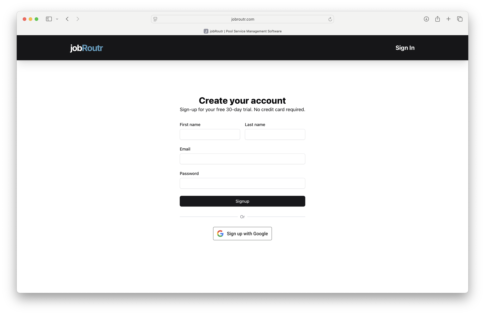
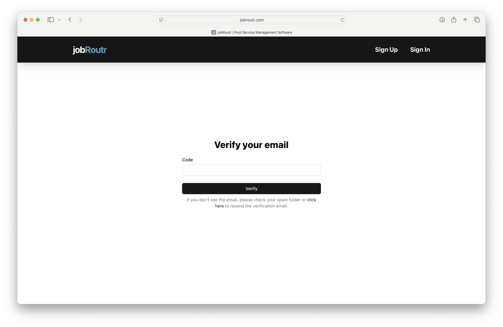

# Creating an Account

Welcome to JobRoutr! This guide will walk you through the process of creating your account.

## Prerequisites

Before you begin, make sure you have:
- A valid email address
- Access to your email for verification

## Steps to Create Your Account

### 1. Navigate to the Sign Up Page

Visit [JobRoutr.com](https://jobroutr.com) and click on the **Sign Up** button.

### 2. Fill in Your Information

Enter the following information:
- **Full Name**: Your first and last name
- **Email Address**: Your work or personal email
- **Password**: Create a strong password (minimum 8 characters)

### 3. Verify Your Email

After submitting the form, you'll receive a verification email. Copy the 6 digit code and paste into the  code text box on the Verify your email page.

### 4. Complete Your Profile

Once verified, log in to your new account and complete the onboarding process:
- Create Organization
- Connect QuickBooks
- Build Services
- Configure Email
- Invite Team

## Troubleshooting

### Didn't Receive Verification Email?

- Check your spam or junk folder
- Verify you entered the correct email address
- Request a new verification email from the login page

### Password Requirements Not Met?

Your password must:
- Be at least 8 characters long
- Include at least one uppercase letter
- Include at least one number
- Include at least one special character

## Next Steps

After creating your account, you can:
- [Create Organization](/docs/onboarding/create-organization.md)

## Need Help?

If you encounter any issues during account creation, please contact our support team at support@jobroutr.com.
