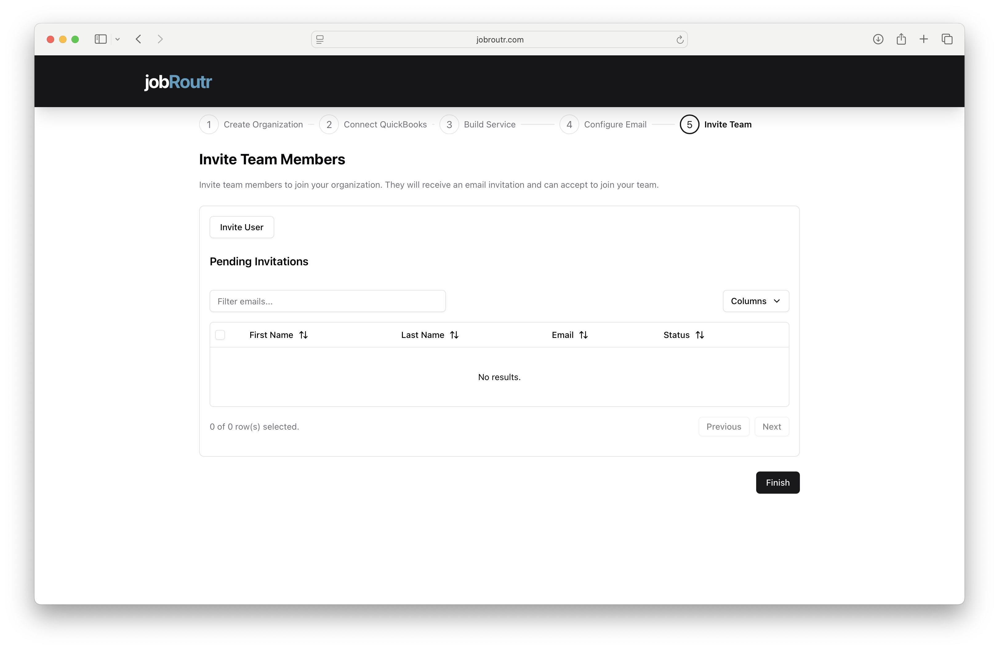
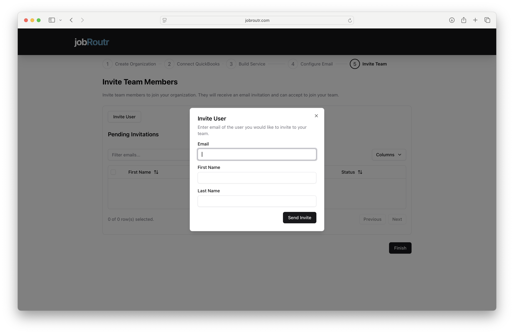

# Invite Team Members

Welcome to the final step of onboarding! Inviting team members allows you to collaborate with your staff, assign work, and manage your service operations efficiently. Team members can access JobRoutr from both the web dashboard and mobile app.

## Overview

This is **Step 5 of 5** - the final step in the onboarding process! In this step, you'll:
- Invite team members to join your organization
- Send email invitations
- Track pending invitations
- Complete the onboarding process

## Why Invite Team Members?

Adding team members enables you to:
- **Assign jobs** - Dispatch work to specific technicians
- **Track progress** - Monitor job completion in real-time
- **Mobile access** - Team members use the mobile app in the field
- **Collaboration** - Work together on scheduling and routing
- **Accountability** - Track who completed which services
- **Efficiency** - Streamline communication and operations

## Getting Started

When you first access the Invite Team page, you'll see:
- **Invite User** button at the top
- **Pending Invitations** section showing sent invitations
- **Finish** button to complete onboarding

:::info Optional Step
Inviting team members is optional during onboarding. You can skip this step and invite team members later from the Settings menu. However, if you have staff who will be performing services, we recommend inviting them now.
:::

## Inviting a Team Member

### Step 1: Click Invite User

Click the **Invite User** button at the top of the page. A dialog will appear.

### Step 2: Fill Out Team Member Information

Complete the following fields:

#### Email (Required)
Enter the email address of the team member you want to invite.
- Must be a valid email address
- They'll receive an invitation at this address
- Each email can only be used once per organization
- Example: `john.smith@example.com`

:::warning Email Accuracy
Double-check the email address for typos. The invitation will be sent to this address, and if it's incorrect, your team member won't receive it.
:::

#### First Name (Required)
Enter the team member's first name.

#### Last Name (Required)
Enter the team member's last name.

### Step 3: Send the Invitation

1. Review all information for accuracy
2. Click the **Send Invite** button
3. The invitation will be sent immediately via email
4. The team member will appear in the "Pending Invitations" list

## What Happens After Sending an Invitation?

### 1. Email Invitation Sent
Your team member will receive an email invitation to join your organization in JobRoutr. The email includes:
- A personalized invitation message
- Your organization name
- Instructions to create an account
- A link to accept the invitation

### 2. Team Member Creates Account
The invited user clicks the link in the email and:
- Creates their JobRoutr account
- Sets up their password
- Provides basic profile information

### 3. Accept Organization Invitation
After creating their account, they are prompted to:
- Review your organization invitation
- Accept to join your team
- Become an active user in your organization

### 4. User Joins Your Organization
Once they accept:
- They become a member of your organization
- They are automatically assigned the **Technician Role**
- They gain access to the dashboard and can download the mobile app

:::info Default Role
All newly invited team members are automatically assigned the **Technician Role**. You can change their permissions later from the Dashboard settings.
:::

## Pending Invitations

The Pending Invitations section displays all team members you've invited who haven't yet accepted.

### Table Columns:
- **First Name** - Team member's first name
- **Last Name** - Team member's last name
- **Email** - Email address where invitation was sent
- **Status** - Current status of the invitation (Pending, Accepted, Expired)

### Features:
- **Search/Filter** - Use the "Filter emails..." search box to find specific invitations
- **Sort** - Click column headers to sort by name, email, or status
- **Columns** - Customize visible columns using the "Columns" dropdown
- **Pagination** - Navigate multiple pages if you have many invitations

### No Results?
If you see "No results," it means:
- You haven't sent any invitations yet, OR
- All previous invitations have been accepted

## Managing Team Member Permissions

After team members join your organization, you can manage their roles and permissions.

### Changing Roles and Permissions:

1. Navigate to **Dashboard** > **Team** or **Settings** > **Team Members**
2. Find the team member you want to modify
3. Click on their profile or the edit button
4. Update their role or specific permissions
5. Save changes

### Available Roles:
- **Owner** - Full access to all features and settings
- **Admin** - Can manage jobs, routes, and team scheduling
- **Technician** - Can view assigned jobs and complete work in the field

:::tip Permission Management
The default Technician role is appropriate for field staff who will use the mobile app to complete jobs. Promote trusted team members to Admin roles for broader access.
:::

## Mobile App Access

Once team members join your organization:

### They Can Access the Mobile App:
1. **Login to Dashboard** - Team members log in to the web dashboard
2. **Download Link** - They'll see a link to download the mobile application
3. **Install App** - Available for iOS and Android devices
4. **Login to Mobile** - Use the same credentials as the web dashboard
5. **Start Working** - View assigned jobs, update status, complete tasks

### Mobile App Features:
- View assigned routes and stops
- Navigate to customer locations
- Complete service tasks with checklists
- Upload photos and notes
- Mark jobs complete
- Offline mode for areas with poor connectivity

:::tip Mobile-First Workflow
Most technicians will primarily use the mobile app for day-to-day work. The web dashboard is mainly for administrators and owners to schedule, route, and monitor operations.
:::

## Inviting Multiple Team Members

To invite multiple team members:

1. Click **Invite User**
2. Fill out the first team member's information
3. Click **Send Invite**
4. Repeat the process for each additional team member

**How Many Should You Invite?**
- Invite all technicians who will perform services
- Include office staff who need dashboard access
- Add managers 
- You can always invite more later

:::info No Limit
There's no limit to how many team members you can invite. Add everyone who needs access to JobRoutr.
:::

## Completing Onboarding

Once you've invited your team members (or decided to skip this step):

1. Click the **Finish** button in the bottom right
2. You'll be redirected to your main JobRoutr dashboard
3. Onboarding is complete - you're ready to start using JobRoutr!

:::success Congratulations! 🎉
You've completed the JobRoutr onboarding process! You're now ready to start creating jobs, scheduling routes, and managing your service business efficiently.
:::

## What to Do Next

Now that onboarding is complete, here are your next steps:

### Immediate Actions:
1. **Explore the Dashboard** - Familiarize yourself with the main interface
2. **Create Your First Customer** - Add customer information
3. **Schedule a Job** - Create and assign your first service job
4. **Test the Workflow** - Walk through the complete process
5. **Have Team Members Download Mobile App** - Ensure field staff have the app installed

### Ongoing Tasks:
- Add more customers as needed
- Create recurring service schedules
- Build and optimize routes
- Monitor job completion and performance
- Review reports and analytics
- Adjust settings as your business grows

## Onboarding Checklist - Complete! ✓

Review what you've accomplished:

- [x] **Step 1: Create Organization** - Set up company details and billing address
- [x] **Step 2: Connect QuickBooks** - Integrated accounting (if applicable)
- [x] **Step 3: Build Service** - Created service offerings with tasks
- [x] **Step 4: Configure Email** - Set up customer communications
- [x] **Step 5: Invite Team** - Added team members to your organization

## Troubleshooting Team Invitations

### Team Member Didn't Receive Invitation Email

**Check These Items:**
1. Verify the email address is correct
2. Ask them to check spam/junk folders
3. Confirm their email service isn't blocking JobRoutr emails
4. Resend the invitation if needed

### Invitation Link Expired

Invitation links may expire after a certain period:
1. Go to the Invite Team page
2. Find the invitation
3. Resend the invitation
4. Team member uses the new link

### Team Member Can't Accept Invitation

Common issues:
- **Wrong email** - Ensure they're checking the email address where the invitation was sent
- **Browser issues** - Try a different browser or clear cache

### Need to Remove a Team Member

To remove someone from your organization:
1. Go to **Settings** > **Team Members**
2. Find the team member
3. Click on their profile
4. Select "Remove from Organization" or "Deactivate"

## Best Practices

### Timing
- **Invite early** - Give team members time to set up accounts before they need to use the system
- **Training time** - Allow time for team members to familiarize themselves with the platform
- **Test first** - Have team members test the mobile app before going live

### Communication
- **Notify in advance** - Let team members know an invitation is coming
- **Provide instructions** - Share how to accept the invitation and set up their account
- **Training session** - Consider a brief training for new users
- **Support resources** - Point them to help documentation and support

### Security
- **Verify email addresses** - Only invite known team members
- **Appropriate permissions** - Start with Technician role, promote as needed
- **Regular reviews** - Periodically review active team members
- **Offboarding** - Remove access when team members leave

### Organization
- **Use real names** - Helps with identification and accountability
- **Consistent naming** - Use full names consistently
- **Role clarity** - Ensure team members understand their role and permissions

## Managing Your Team Later

After onboarding, manage your team from:

### Team 
- View all active team members
- Invite additional members
- Edit roles and permissions
- Deactivate or remove members

## Common Questions

### Can I skip inviting team members during onboarding?
Yes! This step is optional. You can complete onboarding and invite team members later when you're ready.

### How many team members can I invite?
There's no limit. Invite as many team members as you need for your operations.

### What if someone accepts the invitation but I want to remove them?
You can remove or deactivate team members from Settings > Team Members at any time.

### Can team members invite other team members?
Only users with Admin or Manager roles (depending on your permission settings) can invite new team members.

### Do team members need separate email addresses?
Yes, each team member must have their own unique email address for their account.

### What if a team member doesn't have an email address?
Every user needs an email for account creation and login. Consider creating a work email for them, or they can use a personal email address.

### Can I resend an invitation?
Yes, if a team member didn't receive the invitation or if it expired, you can resend it from the Invitations list.

### Will team members have access to all customer information?
Access depends on their role and permissions. Technicians typically only see jobs assigned to them, while Admins can see all information.

### Is there a cost per team member?
Pricing depends on your JobRoutr plan. Check your subscription details or contact sales for information about team member pricing.

### Can team members access JobRoutr from their personal devices?
Yes, team members can use both the web dashboard and mobile app from their own devices. This is common for field technicians using personal smartphones.

## Need Help?

For assistance with inviting team members or managing your team:
- **Email:** support@jobroutr.com
- **Help Center:** [help.jobroutr.com](https://help.jobroutr.com)
- **Phone Support:** Available during business hours

---

## You're Ready! 🚀

Congratulations on completing the JobRoutr onboarding process! You now have:
- ✓ Organization set up with billing details
- ✓ QuickBooks integration (if applicable)
- ✓ Services defined with tasks
- ✓ Email communications configured
- ✓ Team members invited (or ready to invite)

**Welcome to JobRoutr!** Start scheduling, routing, and managing your service business more efficiently. If you need any assistance, our support team is here to help.
