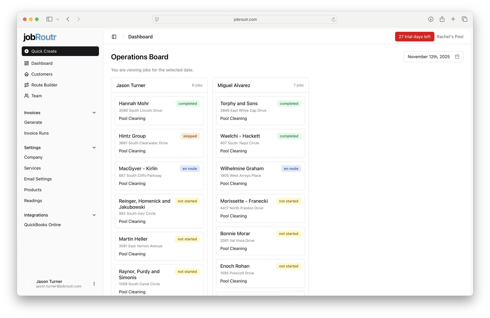

# Dashboard

The Dashboard provides a comprehensive view of your daily operations, displaying all jobs and their current statuses. This is your central hub for monitoring and managing your team's work throughout the day.

## Overview

The Operations Board displays jobs organized by team members, showing their assignments, locations, and current status. You can easily track progress and identify which jobs need attention.

## Viewing Jobs

### Current Date

By default, the Dashboard shows all jobs scheduled for the current date. Each job card displays:

- **Customer Name** - Click to view the full service report with detailed information
- **Address** - The job location
- **Service Type** - The type of work being performed (e.g., Pool Cleaning)
- **Status** - Current job status indicated by color-coded labels:
  - **Completed** (green) - Job has been finished
  - **En Route** (blue) - Technician is traveling to the location
  - **Skipped** (orange) - Job was skipped for the day
  - **Not Started** (yellow) - Job has not been started yet

### Navigating Dates

You can change the date to view jobs from different time periods:

- **Previous Dates** - View job history to see completed work and past performance
- **Future Dates** - See upcoming scheduled jobs to plan ahead and prepare for future work

Use the date selector at the top of the page to navigate between dates.

## Viewing Service Reports

To access detailed information about any job:

1. Click on the **customer name** on any job card
2. The service report will open, showing:
   - Complete job details
   - Service notes and photos
   - Time tracking information
   - Any issues or special requirements

## Team Organization

Jobs are organized by team member columns, with each technician's name shown at the top along with their total number of jobs for the selected date. This layout makes it easy to:

- Monitor workload distribution across your team
- Track individual technician progress
- Identify bottlenecks or scheduling issues
- Balance assignments effectively

## Tips

- Check the Dashboard regularly throughout the day to monitor job progress
- Use the date navigation to review past performance and plan for upcoming work
- Click on customer names to access detailed service reports when you need more information
- Pay attention to status indicators to identify jobs that may need attention
