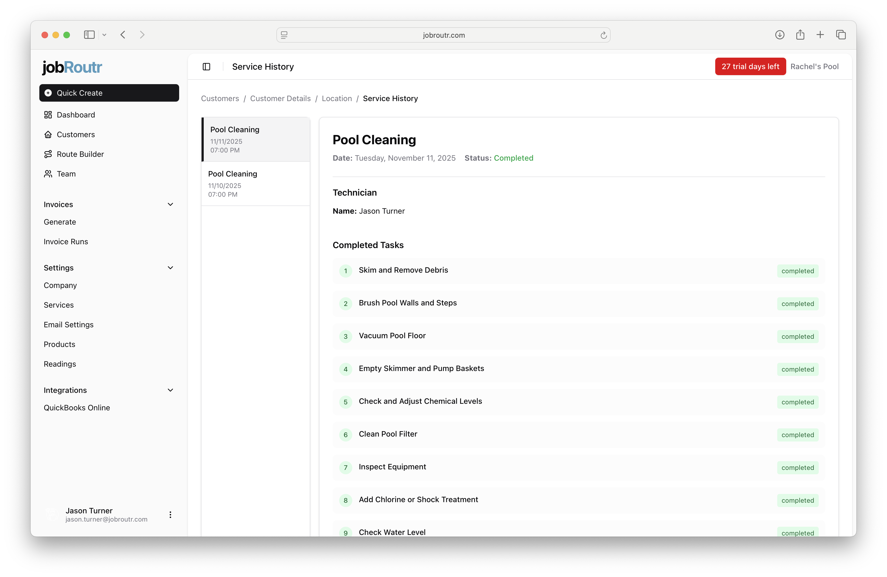
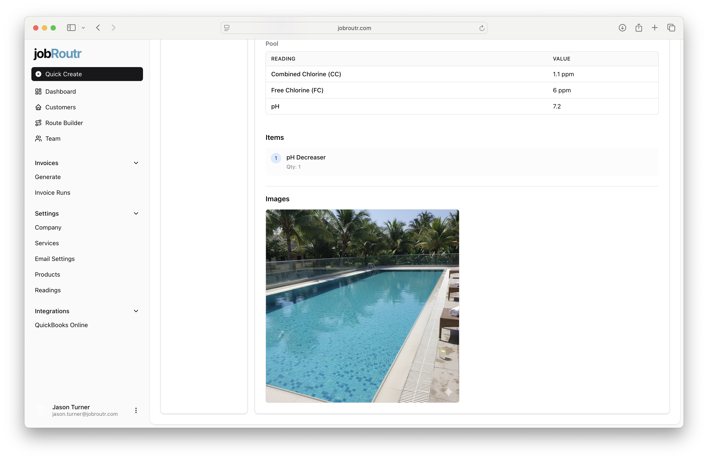

# Service History

Service History provides a detailed record of all completed services for a customer location. This comprehensive view includes service details, technician information, completed tasks, readings, items used, and photos captured during the service.

## Accessing Service History

You can access Service History in two ways:

1. **From the Dashboard**: Click on the technician's name on any scheduled or completed job
2. **From Customer Details**: Navigate to a service location and click the **Service History** button

## Service History Overview

The Service History page displays a chronological list of all services performed at a location. Each service entry shows:

- **Service Type**: The type of service performed (e.g., Pool Cleaning)
- **Date and Time**: When the service was completed
- **Status**: Current status of the service (e.g., Completed)

### Service Details

When you select a specific service from the history, you'll see comprehensive information including:

#### Service Information
- **Date**: The date the service was performed
- **Status**: Completion status with visual indicators (green for completed)
- **Technician**: Name of the technician who performed the service

#### Completed Tasks

A detailed checklist of all tasks completed during the service visit, including:

Each task is marked with a numbered indicator and "completed" status in green.

## Readings

The Readings section displays water chemistry measurements taken during the service:

### Pool Readings Table
| Reading | Value |
|---------|-------|
| Combined Chlorine (CC) | 1.1 ppm |
| Free Chlorine (FC) | 6 ppm |
| pH | 7.2 |

These readings help track water quality over time and ensure proper chemical balance.

## Items Used

This section lists any products or materials used during the service:
- **Item Name**: Description of the product used
- **Quantity**: Amount used during the service

Example: "pH Decreaser - Qty: 1"

## Images

Photos captured by the technician during the service visit are displayed in the Images section. These photos provide visual documentation of:
- Pool condition before/after service
- Equipment status
- Any issues or concerns
- Proof of service completion

Images are stored chronologically.

## Benefits of Service History

- **Transparency**: Customers can see exactly what work was performed
- **Quality Control**: Verify all tasks were completed as scheduled
- **Historical Records**: Track trends in water chemistry and service needs
- **Documentation**: Visual proof of service completion and property condition
- **Issue Tracking**: Identify recurring problems or maintenance patterns

## Tips for Using Service History

- Review service history before scheduling maintenance to identify patterns
- Share service history with customers for transparency
- Use historical readings to optimize chemical treatment plans
- Reference photos when discussing equipment issues or upgrades
- Compare completion times and task lists across different technicians