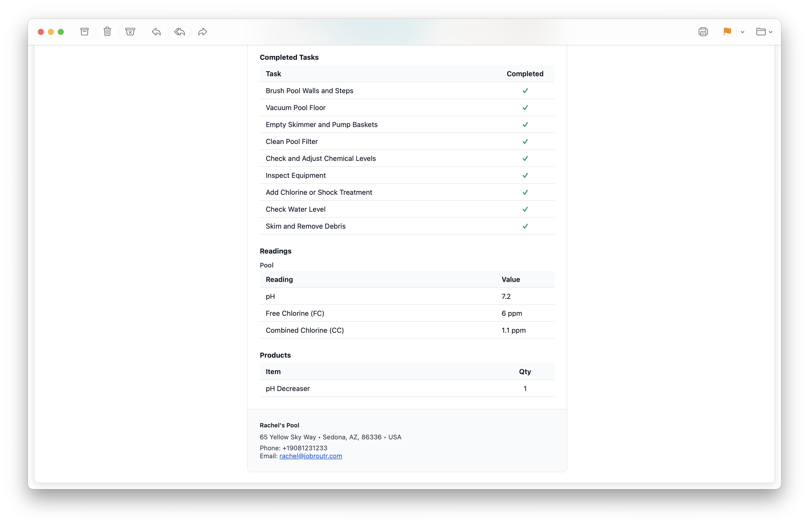

# Service Reports

Service Reports are professional email notifications automatically sent to customers after a service visit is completed. These reports provide customers with detailed information about the work performed, including completed tasks, readings, products used, and photos from the service visit.

## Overview

Service Reports help maintain transparency and communication with your customers by automatically documenting each service visit. When a job is marked as completed, the system can send a branded email report to the customer with all relevant service details.

## Report Contents

Each Service Report includes the following information:

### Header Information
- **Company Name**: Your business name and branding
- **Service Title**: The type of service performed
- **Customer Name**: The customer receiving the service
- **Service Date**: When the service was completed
- **Location**: Which property location was serviced (Primary, Secondary, etc.)

### Service Photo

A professional photo from the service visit is prominently displayed, providing visual confirmation of the completed work.

## Detailed Service Information

The second part of the report provides comprehensive service details:

### Completed Tasks

A complete checklist of all tasks performed during the service visit. Each task shows:
- Task name with checkmark indicator
- Status: "Completed" in green

### Readings Section

Water chemistry measurements and other relevant readings taken during the service:

**Pool Readings Table:**
| Reading | Value |
|---------|-------|
| pH | 7.2 |
| Free Chlorine (FC) | 6 ppm |
| Combined Chlorine (CC) | 1.1 ppm |

### Products Section

A list of any products or materials used during the service:

**Items Used:**
| Item | Quantity |
|------|----------|
| pH Decreaser | 1 |

### Company Contact Information

The footer includes your business contact details:
- Business address
- Phone number
- Email address

## Automatic Delivery

Service Reports can be configured to send automatically when:
- A job status is changed to "Completed"

This ensures customers receive timely updates about their service without requiring manual intervention.

## Benefits

Service Reports provide several advantages:

- **Customer Communication**: Keep customers informed about completed work
- **Transparency**: Show exactly what tasks were performed and readings taken
- **Professionalism**: Branded emails enhance your business image
- **Documentation**: Create a paper trail for services rendered
- **Accountability**: Customers can see the thoroughness of your service
- **Product Tracking**: Document materials used for billing and inventory

## Customization

Service Reports automatically pull information from:
- Your company settings and branding
- The specific service template and checklist
- Readings entered by technicians
- Photos captured during the visit
- Products/items recorded in the system

:::tip
Ensure your technicians complete all sections of a service visit (tasks, readings, photos) to provide customers with comprehensive service reports.
:::
