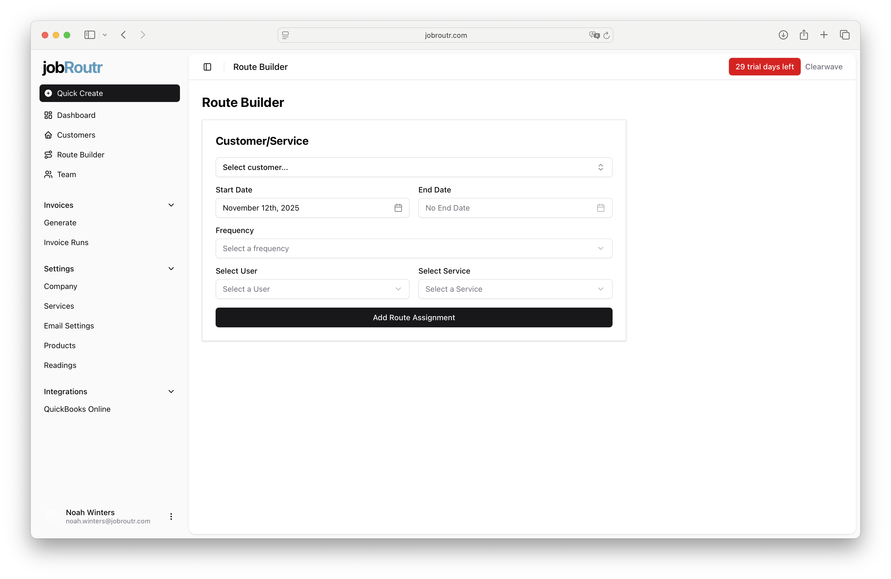
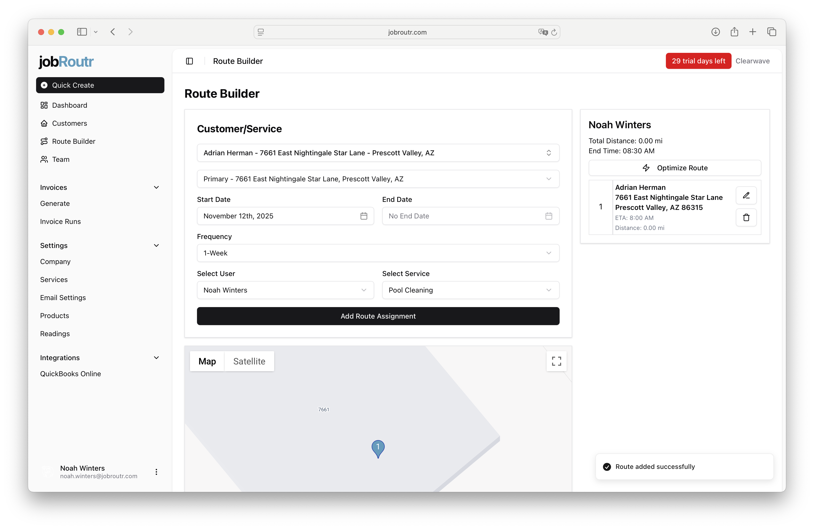
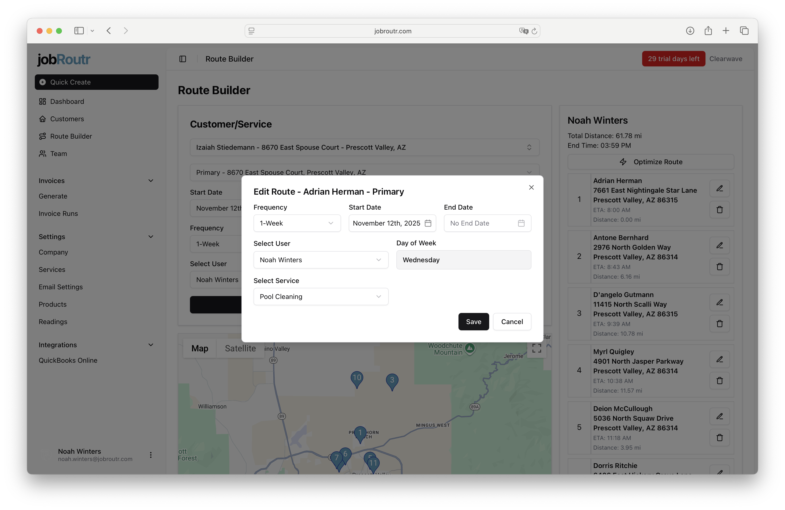
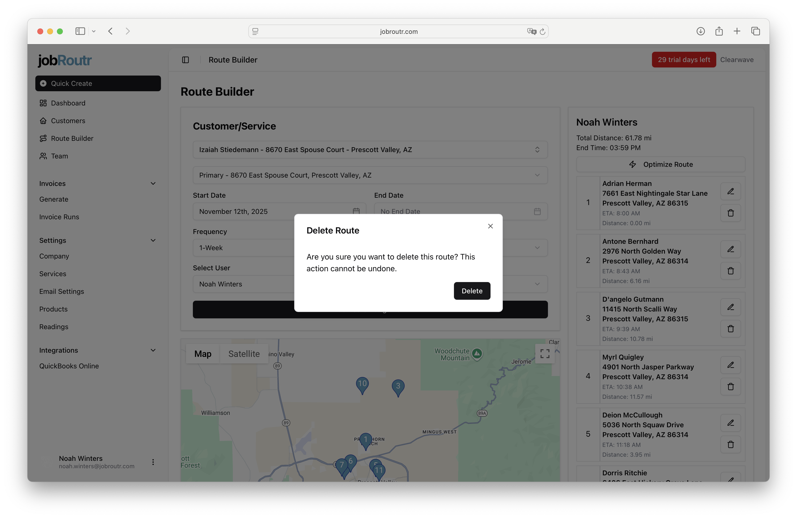
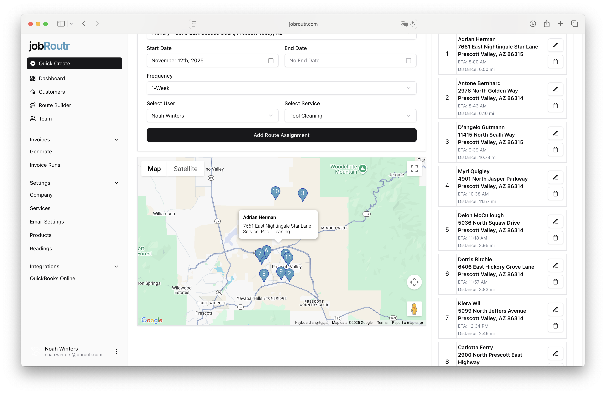

# Route Builder

## Understanding Routes vs Jobs

Before you begin building routes, it's important to understand the distinction between **Routes** and **Jobs**:

- **Route**: A schedule template for upcoming jobs. Routes define the recurring pattern and assignments for your service visits.
- **Job**: An instance of a route that is generated for a specific date. Jobs are created automatically from your routes.

:::caution Important
Jobs are generated by an hourly automated process. If you add a route to the current date, it will need to wait for the next hourly job process to run before the job appears on the schedule. 

**For mobile app users**: Technicians can swipe down on the schedule screen to refresh their data and see newly generated jobs.
:::

## Overview

The Route Builder helps you create and manage optimized service routes for your team. You can assign customers to specific team members, set schedules, and visualize routes on an interactive map.

## Getting Started with Route Builder

When you first access the Route Builder, you'll see a clean interface where you can begin creating your route assignments.

### Required Fields

To create a route, you need to specify:

- **Customer/Service Location**: Select the customer and their service location
- **Start Date**: When this route assignment begins
- **End Date**: Optional - when this route assignment should end
- **Frequency**: How often the service occurs (e.g., 1-Week, 2-Week, etc)
- **Select User**: The team member assigned to this route
- **Select Service**: The service to be performed at this location

Once all required fields are filled in, click **Add Route Assignment** to add the stop to your route.

## Adding Your First Route

After adding your first route assignment, the interface updates to show your route details and begins calculating important metrics.

### Route Summary

On the right side panel, you'll see:

- **Total Distance**: Calculated distance for the entire route (in miles)
- **End Time**: Estimated completion time for the route
- **Individual Stop Details**: Each stop shows:
  - Customer name and address
  - ETA (Estimated Time of Arrival)
  - Distance from the previous stop
  - Edit and delete options

:::tip
As you add more stops, jobRoutr automatically calculates the cumulative distance and updates the end time estimate to help you plan efficient routes.
:::

## Editing a Route Assignment

You can modify any route assignment by clicking the edit icon (pencil) next to the stop. This opens a modal window with the route details.

### Editable Fields

In the edit modal, you can update:

- **Frequency**: Change how often the service occurs
- **Start Date**: Adjust when the route assignment begins
- **End Date**: Set or modify when the assignment ends
- **Day of Week**: Calculated based on the start date
- **Select User**: Reassign to a different team member
- **Select Service**: Change the service to be performed

Click **Save** to apply your changes, or **Cancel** to discard them.

## Deleting a Route Assignment

If you need to remove a route assignment, click the delete icon (trash can) next to the stop. A confirmation modal will appear to prevent accidental deletions.

:::warning Important Note
Deleting a route removes it entirely from the system, even for future dates. If you want to stop a route at a specific time but preserve the route until that date, use the **End Date** field instead of deleting the route.
:::

The deletion action cannot be undone, so the system asks you to confirm before proceeding.

## Visualizing Routes on the Map

The Route Builder includes an interactive map that displays all stops on your route, making it easy to visualize the path and identify potential optimizations.

### Map Features

- **Location Pins**: Each stop is marked with a pin showing the customer's location
- **Map/Satellite Toggle**: Switch between map and satellite views
- **Zoom Controls**: Adjust the map view to see details or the full route
- **Pin Details**: Click any pin to see customer information and service details

:::tip Optimization
Use the map view to identify opportunities to reorder stops for more efficient routing based on geographic proximity. The visual representation makes it easy to spot when stops can be reorganized to reduce travel time and distance.
:::

## Best Practices

1. **Set End Dates Instead of Deleting**: When a service is temporarily on hold or ending, use the End Date field rather than deleting the route to maintain the route until the end date.

2. **Use the Map for Optimization**: Regularly review the map view to ensure your route assignments are geographically efficient.

3. **Monitor Distance and Time**: Keep an eye on the Total Distance and End Time to ensure routes are reasonable and achievable within a workday.

4. **Group by Day and Team Member**: Organize routes by assigning specific days to specific team members for consistency and efficiency.

5. **Update Frequencies as Needed**: Customer needs change - use the edit function to adjust service frequencies when requirements change.

---

With the Route Builder, you can efficiently manage your team's service routes, optimize travel time, and ensure consistent service delivery to all your customers.
