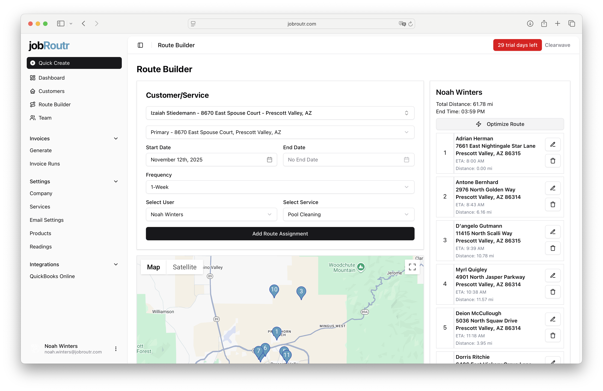
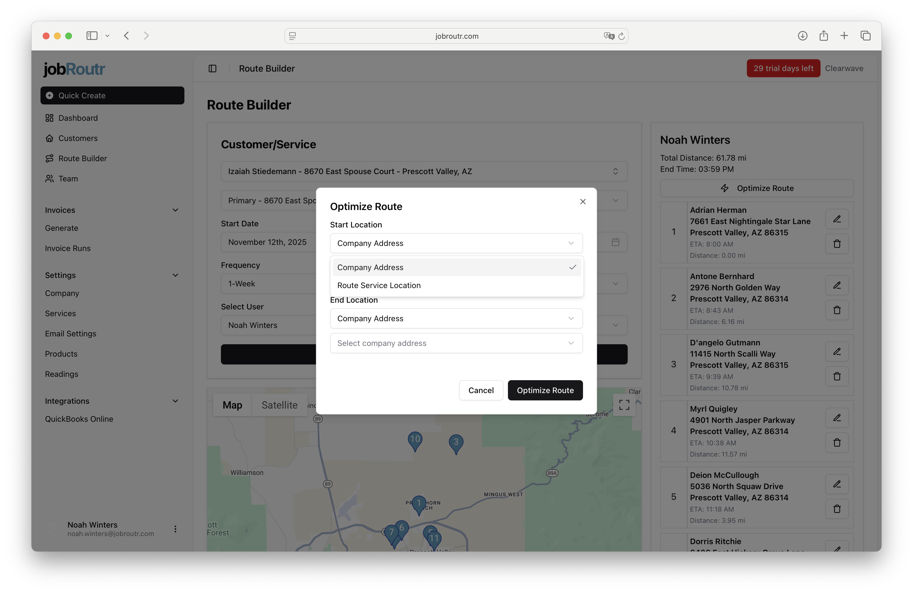
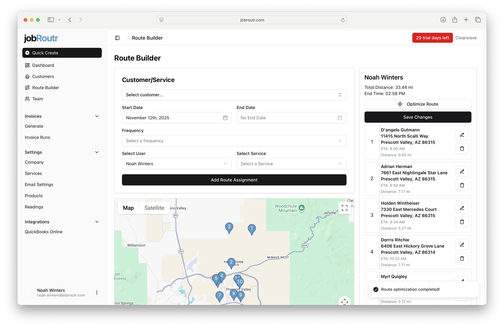

# Route Optimization

Once you've added route assignments in the Route Builder, you can use the route optimization feature to automatically arrange stops in the most efficient order. This feature helps reduce travel time and distance while respecting your starting and ending locations.

## Optimizing Your Route

After creating your route assignments, click the **Optimize Route** button to begin the optimization process.

### Setting Optimization Parameters

When you click the Optimize Route button, a modal will appear allowing you to specify your optimization preferences.

You can configure:

- **Starting Location**: Where the route should begin
- **Ending Location**: Where the route should end

Both starting and ending locations can be:
- A **company address** (configured in Additional Setup - see [Company Settings](../additional-setup/company-settings.md) for details)
- One of the **locations from your selected route**

:::tip
Setting proper start and end points helps ensure your routes align with your team's actual workflow, such as starting from your office and returning at the end of the day.
:::

## Previewing and Saving Optimized Routes

After the optimization runs, you'll see a preview of your optimized route on the map with updated stop sequences and route metrics.

### Review the Results

The preview shows:
- Updated stop order based on optimization
- Recalculated total distance
- New estimated end time
- Visual route path on the map

### Saving Your Changes

If you're satisfied with the optimized route:

1. Review the stop order and route metrics
2. Click **Save Changes** to apply the optimization
3. Your route assignments will be updated with the new order

:::note
If the optimized route doesn't meet your needs, you click and hold the number of the route and drag and drop it to manually adjust your route assignments instead.
:::

## Best Practices

- **Set realistic start and end locations** that match your team's actual workflow
- **Review the optimized route** before saving to ensure it makes sense for your specific situation
- **Consider time windows and customer preferences** that may not be captured by distance-based optimization
- **Re-optimize periodically** when you add or remove stops from an existing route
